转自：https://blog.csdn.net/weixin_39278265/category_9276458.html

### 一、人工智能及智能认识：

#### 1.到底什么是AI （AI该如何定义）？

1）Acting humanly: The Turing Test approach
主要就是图灵测试。如果一台机器能够伪装到人类都无法区分其和真人的差别，那么我们就说这台机器是智能的

2）Thinking humanly: The cognitive modelling approach
这个维度是认知科学（cognitive science approach）的角度来解释AI。故涉及到认知科学和认知神经学两个方面。

3）Thinking rationally: The laws of thought approach
Thinking rationally（理性思考）主要涉及到一些推导求解（reasoning）。

4）Acting rationally: The rational agent approach
Acting rationally：理智行动也就是朝着特定目标的行动	


#### 2. What is intelligence? 到底什么是智能？ 

（1）符号主义视角
何为智能：“思考” 表现为对物理系统和问题的符号表示以及基于符号的推理
怎么实现智能：提供表示方法和推理工具
代表成果：知识表示、搜索、规划、推理、专家系统等 & “深蓝”国际象棋程序、 “Watson”问答系统

（2）连接主义视角
何为智能：像人一样“思考 & 认为人类的思考以人脑的生物神经网络为载体
怎么实现智能：构造人工神经网络来模拟生物神经网络
代表成果：神经网络、深度学习等 & AlphaGo，GNMT(机器翻译程序)等

（3）行为主义视角
何为智能：表现为恰如其分的“行动 & “行动”基于“控制论” 的感知-建模-决策-执行模型以及对一些群体性生物行为方式的观察
怎么实现智能：基于控制论以及群体智能等建立起及其智能 & 提供模型、算法
代表成果：反应式系统、进化计算、群体智能、蚁群算法等 & 群体无人机、机器人行走、无人车等


### 二、Agent相关:

#### 1. what is an agent

agent就是能够行动的某种东西

传感器+执行器（+性能度量+环境）

例子 
　　拿我们人类做类比：我们的五官（五感）就是sensors，我们的身体各部分（手，足等）就是actuators。 
而robotic agents靠我们给的sensors（camera，microphones 麦克风，infrared detectors 红外探测）来感知环境，它们进行一些计算（computing/think），然后通过各种各样的motors（马达，发动机）/actuators来做出行动。

#### 2 What is an intelligent agent (也叫做Rational Agents)?

An agent which acts in a way that is expected to maximize to its performance measure, given the evidence provided by what it perceived and whatever built-in knowledge it has.

给定agent感知到的内容和内置知识加上逻辑推理做出最有利的行动。

#### 3.Agent的PEAS特性及其环境特性

（1）Performance, Environment, Actuators and Sensors (PEAS).

（2）环境特性

 @@@Fully observable and partially obeservable	 		

全局可察，部分可察

例子：chess是全局可察的，但是poker（纸牌游戏，你可以想成是斗地主）不是。

@@@Deterministic and stochastic(确定，随机)

随机环境不仅仅只是由当前agent的状态和行动决定

@@@Static and dynamic

环境是动态的还是静态的

@@@Discrete and continuous

分离的，连续的

@@@Single agent and Multi-agent

#### 4.Agent的分类

1）Simple reflex agents
　　在做出行动时，仅仅只基于当前状态，忽略历史（过去的）感知信息。 

2）Model-based reflex agents

保留了部分可观察环境的踪迹（一些信息，路径之类的吧），整个environment/world在此基础上建模

3）Goal-based agents

该类agent是在model-based agent上的改进，适用于“光知道当前状态还不够（做出决定，行动）”的情况。其中，agent在做决定的时候考虑了goal information。

（比方说走迷宫？这让我想起了搜索算法。）

4）Utility-based agents

　这让我想起了搜索算法中更加复杂的情况（考虑一些其他的cost）。 

5）Learning Agents

Learning element: responsible for making improvements. 
Performance element: responsible for selecting external actions. It is what we considered as agent so far. 
Critic: How well is the agent is doing w.r.t. a fixed performance standard. 
Problem generator: allows the agent to explore. 


#### 5.learning agent的各个部件：

执行部件即前面考虑的整个Agent，接受感知，选择动作。
学习部件根据评判部件的反馈评价Agent做得如何，从而确定如何修改执行部件。
评判部件根据性能标准告知学习部件Agent的运行情况。当“将军”发生了，评判部件告知学习部件：好事情发生了 
（性能标准是固定的，Agent不应该修改性能标准来适应自己的行为）
问题生成器可向执行部件建议探索性行动，短期内可能是次优的行动，但长远而言可能是更好的行动


### 三、搜索问题：

这一章说的是Agent，但是是搜索Agent

#### 1.问题的形式化：

初始状态，目标状态，后继函数，耗散函数

#### 2.搜索策略：节点扩展顺序的选取

性能评价：完备性、时间复杂度、空间复杂度、最优性
衡量时间和空间复杂度相关的项：分支因子b、最浅的目标节点的深度d、最大深度m

无信息搜索策略：只利用问题定义中提供的状态信息
广度优先搜索、一致代价搜索、深度优先搜索、深度受限搜索、迭代加深的深度优先搜索

1)广度优先搜索：扩展未扩展过的最浅节点，将边缘组织成FIFO队列实现，新的厚积节点加入到队列尾

时间？1+b+b^2+b^3+...+b^d+b(b^d-1) = O(b^(d+1))，即d的指数
空间？O(b^(d+1))（保存所有节点在内存中）

空间代价是最大的问题

2)一致代价搜索：扩展代价最小的未扩展的节点，边缘组织成按路径损耗排序的队列实现，若单步代价均相等则等价于广度优先搜索

3)深度优先搜索：扩展深度最深的未扩展过的节点，边缘=LIFO队列，后继结点放在队列前

时间？O(b^m)，若m比d大很多，时间消耗更多，但若解是密集的，则比广度优先搜索更快
空间？O(b^m)，即线性

4)深度受限搜索：设置界限l，解决无限深度路径问题
若l<d，不完备，若l>d，非最优

5)迭代加深的深度优先搜索：每轮增加深度限制的深度受限搜索

#### 3.A*搜索：

f(n)=g(n)+h(n)

f(n)，当前结点的估计最优耗散值

h(n)，启发函数，节点n到目标节点的最低耗散路径的耗散值的估计值

g(n)，从出发点到达节点n的耗散

每次拓展f(n)最小的结点

f(n)=2 g(n)  ,拓展的是路径耗散值最低的结点，代价一致搜索

f(n)=2 h(n)，f(n)完全由估计决定

#### 4.可采纳性，一致性，准确性，松弛问题

（1）可采纳启发式：是指启发式函数从不会过高估计到达目标的代价。所以：f(n)=g(n)+h(n)永远不会超过经过节点n的解的实际代价。（罗马尼亚问题就是一个例子，因为直线距离最短）

（2）一致性（也叫单调性），只作用在图搜索中使用A*算法：如果对每个节点n和通过任一行动a生成的n的每个后继节点n’，从节点n到达目标的估计代价不大于从n到n’的单步代价与从n’到达目标的估计代价之和。（这是一个三角不等式，罗马尼亚问题是一个例子）

h(n)<=c(n,n')+h(n')	从n到目标结点的估计花销<=n到n'的实际花销+n'到目标结点的估计花销

（3）很容易证明（在课本习题3.29）：一致的启发式都是可采纳的。

h(a1)-h(a2)<=c(a1,a2)

h(a2)-h(a3)<=c(a2,a3)

......多个式子累加 h(a1)-h(an)<=c(a1,an)

（4）构造一个非一致的可采纳启发式

a--b--c, c(a,b)=2, c(b,c)=2。h(a)=4,h(b)=1。

这样h(a)<=h(b)+c(a,b)是不成立的。

（5）一般来说使用值更大的启发式函数比较好

（6） 从松弛问题设计可采纳的启发式

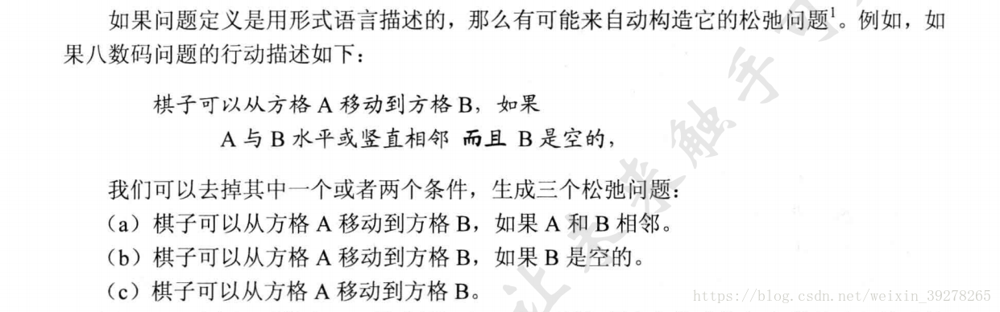

减少了行动限制的问题称为松弛问题。

更进一步，由于得出的启发式是松弛问题的确切代价，那么它一定遵守三角不等式，因而是一致的


### 四、超越经典搜索（局部搜索）

#### 1.什么是局部搜索

局部搜索不关心路径代价，但是关注解状态。比如八皇后问题，不关心是怎么到目的状态的，只关心最终布局对不对。一般情况下不保留搜索路径。 

### 2.##一些局部搜索算法##

(1)爬山法（最陡上升版本）

简单的循环过程，不断向值增加的方向移动，即“登高”，在到达一个“峰顶”（邻接状态中没有比它更高的）的时候终止。

例子：八皇后问题（当前状态指的是一个棋盘放着8个皇后的冲突状态），而且每一次生成新状态（后继节点）是通过：移动某一个（不是多个）皇后到这列的另一个可能方格中，所以每个状态有7*8=56个后继。 但是，爬山法会经常陷入困境。

(2) 随机爬山法

随机爬山法在上山移动中随机选择下一步；被选中的概率可能随着上山移动的陡峭程度不同而不同。这种算法通常比最陡上升算法的收敛速度慢不少，但是在某些状态空间地形图上它能找到更好的解。

(3)首选爬山法

实现了随机爬山法，随机地生成后继节点直到生成一个优于当前节点的后继。这个算法在后继节点很多的时候（比如上千个）是个好策略。(我觉得就是选第一个出现的优于当前结点的后继结点)

(4)随机重启爬山法
之前的三个爬山法都是不完备的，经常会在局部极大值卡住。
随机重启爬山法（random restart hill climbing）， 
它通过随机生成初始状态来导引爬山法搜索，直到找到目标。 
这种算法完备的概率接近1.原因：它最终会生成一个目标状态来作为初始状态。

(5) 模拟退火算法

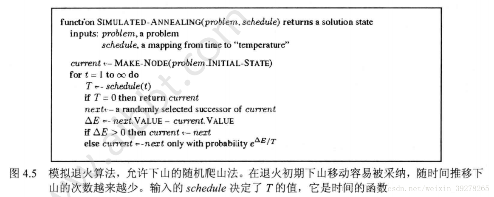

当△E<0时，有e^(△E/T)的可能选择一个没有当前状态好的状态。

而当△E>0时直接选择

(6)局部束搜索

局部束搜索（loca beam search）算法记录k个状态而不是只记录一个，它从k个随机生成的状态开始，每一步全部k个状态的所有后继全被生成。如果其中有一个是目标状态，则算法停，否则从整个后继列表（注意：是整个，这时候不再分开来看）中选择k个最佳后继，重复之。
但是这样的局部束搜索缺乏多样性，很快就会聚集到状态空间中的一小块区域内，使得搜索代价比高昂的爬山法版本还多。 
随机束搜索（stochastic beam search）与随机爬山法类似，并不是选最好的k个，而是随机选择k个，其中选中概率是状态值的递增函数（正比）。随机束搜索类似于自然选择。

(7)遗传算法

Genetic algorithm，或GA，是随机束搜索的一个变形。 

把两个父状态结合来生成后继，而不是通过修改单一状态进行。这和随机剪枝搜索一样，与自然选择类似，除了我们现在处理的是有性繁殖而不是无性繁殖。
像束搜索一样，GA从k个随机状态开始，称之为种群。 
每个状态都由适应度函数给出评估值。有杂交，变异操作。
遗传算法：结合了上山趋势，随机探索，和在并行搜索线程之间交换信息。


### 五、博弈搜索

#### 1.博弈搜索的概念

在多Agent环境中（竞争环境），每个Agent的目标之间是有冲突的，所以就引出了对抗搜索。

人工智能中的博弈通常指博弈论专家们称为有完整信息的，确定性的，轮流行动的，两个游戏者的零和游戏（如象棋）。

博弈问题的的6个元素： 
1）S0：初始状态（游戏开始时的情况） 
2）Player(s)：定义此时该谁动 
3）Actions(s):此状态下的合法移动集合 
4）Result(s,a):转移模型，定义行动的结果 
5）Terminal-test(s)：终止测试，游戏结束返回真，否则假。 
6）Utility(s,p)：效用函数，定义游戏者p在终止状态s下的数值。


#### 2.极小极大值   即最小化对手的最大得益

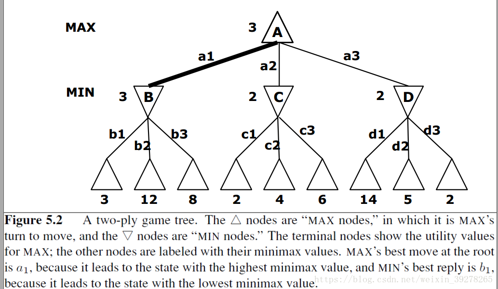

#### 3. Alpha-Beta剪枝算法(转自https://www.7forz.com/3211/)

这是一个常用人机游戏对抗的搜索算法。它的基本思想是根据上一层已经得到的当前最优结果，决定目前的搜索是否要继续下去。

(1)关于alpha值和beta值

```
Alpha-Beta只能用递归来实现。这个思想是在搜索中传递两个值，第一个值是Alpha，即搜索到的最好值，任何比它更小的值就没用了，因为策略就是知道Alpha的值，任何小于或等于Alpha的值都不会有所提高。
第二个值是Beta，即对于对手来说最坏的值。这是对手所能承受的最坏的结果，因为我们知道在对手看来，他总是会找到一个对策不比Beta更坏的。如果搜索过程中返回Beta或比Beta更好的值，那就够好的了，走棋的一方就没有机会使用这种策略了。（如果收益是对自己计算的，那么beta是尽量取小值）
当一个 Min 节点的 β值≤任何一个父节点的α值时 ，剪掉该节点的所有子节点
当一个 Max 节点的 α值≥任何一个父节点的β值时 ，剪掉该节点的所有子节点
```

在搜索着法时，每个搜索过的着法都返回跟Alpha和Beta有关的值，它们之间的关系非常重要，或许意味着搜索可以停止并返回。
如果某个着法的结果小于或等于Alpha，那么它就是很差的着法，因此可以抛弃。因为我前面说过，在这个策略中，局面对走棋的一方来说是以Alpha为评价的。
如果某个着法的结果大于或等于Beta，那么整个节点就作废了，因为对手不希望走到这个局面，而它有别的着法可以避免到达这个局面。因此如果我们找到的评价大于或等于Beta，就证明了这个结点是不会发生的，因此剩下的合理着法没有必要再搜索。
如果某个着法的结果大于Alpha但小于Beta，那么这个着法就是走棋一方可以考虑走的，除非以后有所变化。因此Alpha会不断增加以反映新的情况。有时候可能一个合理着法也不超过Alpha，这在实战中是经常发生的，此时这种局面是不予考虑的，因此为了避免这样的局面，我们必须在博弈树的上一个层局面选择另外一个着法。 

下面是一个实例：

(1)初始状态图：

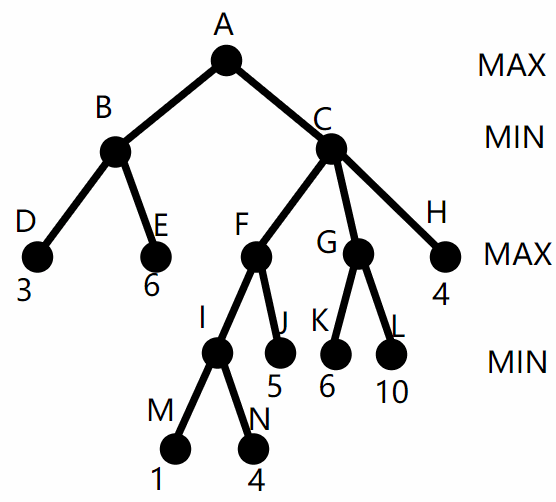

(2)从根节点开始，初始化根节点的 α=-∞，β=∞，向左边的子节点展开。到D节点时，得到D的值为3，返回B节点，由于B节点是Min节点，所以更新B节点的β值为min(∞, 3)=3

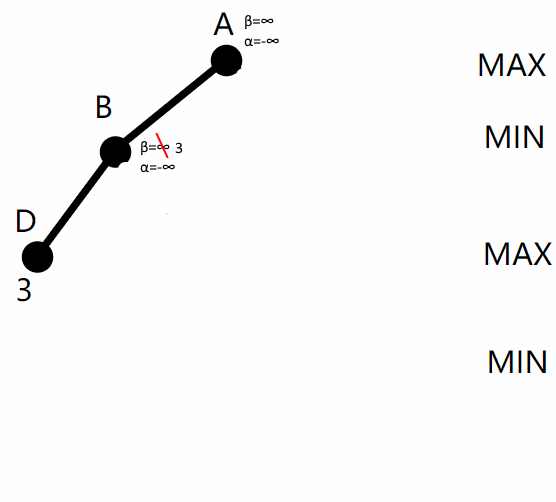


(3)接下来从B到E，再从E返回B，min(3,6)仍为3。从B返回根节点A，A是 Max 节点，更新A的α值为 max(-∞, 3[B的β值])=3，如下图：

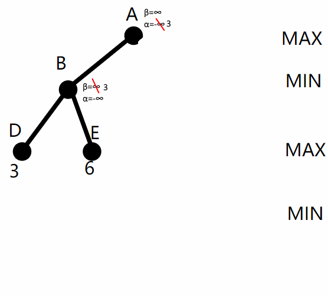

(4)接下来从根节点往右深入，把根节点的 β=∞, α=3 依次传给C、F、I，从 I 深入 M再返回时，I 是 Min 节点，更新 I 的 β = min(∞, 1) = 1。留意到此时 I 的 α=3 ＞ β，所以无需再探索 I 的剩余子节点，把未探索的子节点剪掉，如图3：

（在min结点  α>β时，说明走其他路线对我而言更好，所以直接舍去该结点）

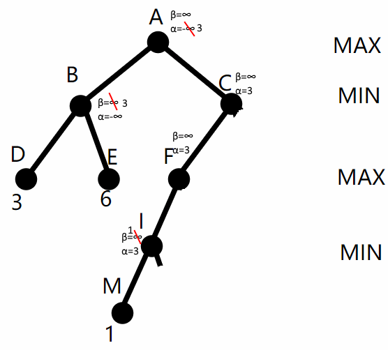

(5)从节点 I 返回到F，F 的 α 值仍为 max(3, 1)=3不变。从F到J再返回，更新 F 的 α = max(3, 5) = 5。从 F 返回 C，更新 C 的 β = min(∞, 5) = 5。此时不更新A结点的 α=5，因为C结点尚未完成。

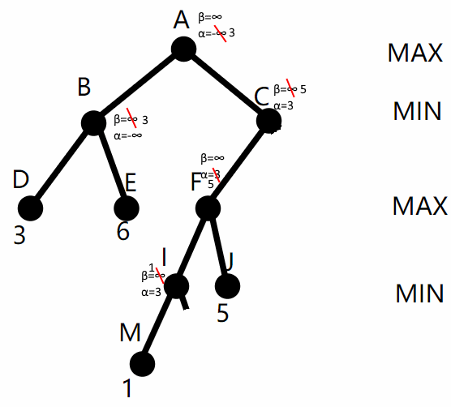

(6)从 C 到 G，把 C 的 β=5, α=3 传给 G，从 G 到 K 再返回 G，更新 G 的 α = max(3, 6) = 6。注意到 G 的 α=6 ＞β，把 G 的其余子节点剪掉，如图5：

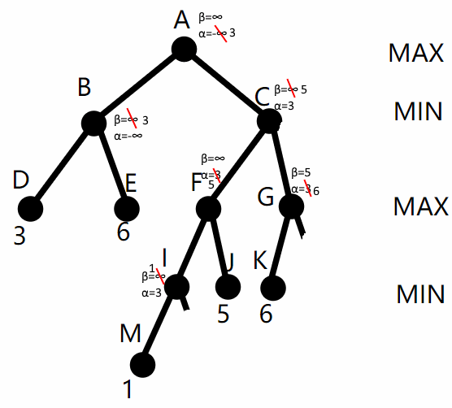


(7)

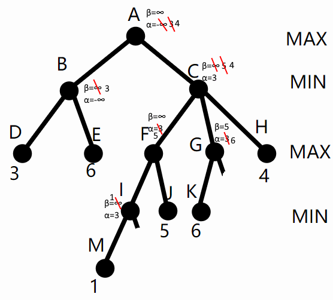


### 六、约束满足问题 (CSP)

#### 1.什么是CSP：

（1）使用要素化来描述状态：一组变量，每个变量有自己的值。当每个变量都有自己的赋值同时满足所有关于变量的约束时，问题就得到了解决。这类问题就叫做约束满足问题（CSP），全称Constraint Satisfaction Problem。

约束满足问题由变量和变量上的约束组成，可以用约束图来表示

（2）主要思想：通过识别违反约束的变量/值的组合迅速消除大规模的搜索空间。

（3）一元约束：只限制单个变量的取值 
		  二元约束：与两个变量有关。

#### 2.约束传播:

（1） 节点相容
单个变量（对应一个节点）值域中的所有取值满足它的一元约束，就是节点相容的。

（2）弧相容
如果 CSP 中某变量值域中所有取值满足该变量所有二元约束，则此变量弧相容。

(3）

@@@最少剩余值启发式(MRV):

选择“合法”取值最少的变量——称为最少剩余值（MRV）启发式。（做一个强有力的引导，方便提早遇到失败，从而剪枝） 

@@@最少约束值：

优先选择的赋值是给邻居变量留下更多的选择（为了找到一个解，所以没必要排序，二十要最少约束）

@@@度启发式：

通过选择与其他未赋值变量约束最多的变量来试图降低未来的分支因子。（用来打破僵局，如选择第一个着色区域。）


### 七、命题逻辑

#### 1.什么是KBA(knowledge based agent):

基于知识的Agent的核心部件是其知识库，或称KB。 

知识库：是一个语句（用知识表示语言表达，表示了关于世界的某些断言）集合。有时，当某语句是直接给定而不是推导得到的时候，我们将其尊称为公理。

即基于知识的Agent，通过感知器，把感知信息加入知识库，向知识库询问最好改采取哪个行动，并告诉知识库它会实施该行动。

#### 2.合取析取

合取
基本符号：∧ 英文名：logicalconjunction 中文名：逻辑与，合取，交集，按位与，逻辑乘，与门，…命题逻辑中的二元连接词合取，是一个两元算子，集合论中的交集算子，二进制中的逻辑乘算子，按位与（Bitwise AND），逻辑门中的“与”门（AND gate），编程语言中的&或and运算符等等。

析取是最常用的逻辑联结词之一，表示“或”的意思。

#### 3.一些公式：

p–>q的意思是若p是真那么q也是真，若p是假q未必是假。也就是说该语句为假的情况只有一种，即p是真而q为假。而 ¬p∨q 为假的条件也只有p真q假这一个。所以两者是等价的。

p–>q等价于 ¬p∨q

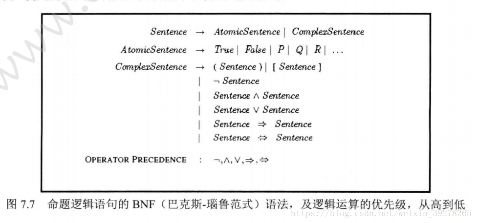

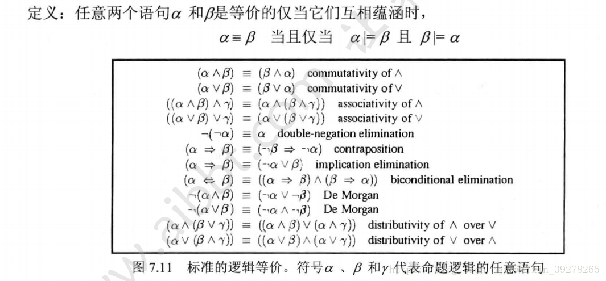


#### 4.合取范式，析取范式:

（1）比如（￢p∨q）∧(￢p∨r) ∧(p∨q∧r)是合取范式，
	   （p∧q）∨(p∧￢q) ∨(p∧q∧r)是析取范式。

（2）求解给定公式范式的步骤：
1消去连接词 
2用双重否定律消去双重否定符，用德摩根律内移否定符
3使用分配律：求析取范式时使用对的分配律，求合取范式时使用对的分配律

（3）例：求（p→q）↔r的析取范式与合取范式

@先消去→和↔：
（p→q）↔r
⇔（￢p∨q）↔r
⇔((￢p∨q) →r) ∧(r→(￢p∨q))
⇔(￢(￢p∨q) ∨r) ∧(￢r∨(￢p∨q))
⇔((p∧￢q)∨r) ∧(￢r∨￢p∨q)
⇔(p∨r) ∧(￢q∨r) ∧(￢r∨￢p∨q)
这就是给定公式的合取范式（外面是与里面是或，外面是合取，里面是析取）

@再求析取范式
（p→q）↔r
⇔（￢p∨q）↔r
⇔((￢p∨q)→r)∧(r→(￢p∨q))
⇔(￢(￢p∨q)∨r)∧(￢r∨(￢p∨q))
⇔((p∧￢q)∨r)∧(￢r∨￢p∨q)
⇔（(p∧￢q)∧￢r）∨（(p∧￢q)∧￢p）∨（(p∧￢q)∧q）∨（r∧￢r）∨
(r∧￢p)∨(r∨q)
⇔(p∧￢q∧￢r)∨ (r∧￢p) ∨(r∨q)
这就是给定公式的析取范式。

### 八、贝叶斯网络:

1.公式：

全概率公式：H发生的可能性
P(H) = P(H|A)P(A) + P(H|B)P(B) 


贝叶斯公式没有前提条件 ，不要求条件独立。

贝叶斯公式: 在H发生的情况下，是A促成的可能性
P(A|H) =P(A)P(H|A)/P(H)

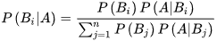

举个简单的例子：村子有且仅有两个小偷，小A和小B，根据统计A偷东西的可能性是0.2,B偷东西的可能性是0.8。如果A去偷，偷成功的概率是0.8， 如果B去偷，偷成功的概率是0.3。如果村子丢了一件东西，A和B谁是嫌疑犯的可能性更大？
H={丢东西}
A = {A去偷东西}
B = {B去偷东西}

A，B两人偷东西可能性 P(A) = 0.2 P(B) = 0.8

A , B两人得手的可能性 P(H|A)=0.8 P(H|B)=0.3，

那么，村子里丢东西的可能性就是 P（H） = P(A)P(H|A) + P(B)P(H|B) = 0.4