1.各机器级的实现主要靠翻译和解释或两者结合进行。
翻译是先用转换程序将高一级机器级上的程序整个地变换成低一级机器级上等效的程序，然后再在低一级机器级上实现的技术。
解释则是在低级机器上用它的一串语句或指令来仿真高级机器上的一条语句或指令的功能，是通过对高级的机器级语言程序中的每条语句或指令逐条解释来实现的技术。


## 2.1 ISA的基本概念	(26页)

指令集体系结构 Instruction Set Architecture


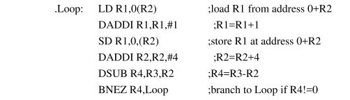

##### （1）ISA分类

寄存器-储存器ISA：可以在许多指令中访问储存器

载入-存储ISA：只能用载入或者存储指令来访问储存器

所有最新的ISA都采用载入储存版本

（2）储存器寻址

所有桌面计算机和服务器计算机都采用字节寻址方式来访问储存器操作数

如果操作数是对齐的，访问速度会快一些。

（3）寻址模式

除了指定寄存器和常量操作数之外，寻址模式还指定了一个储存器对象的地址。

MIPS寻址模式为：寄存器寻址，立即数寻址和位移量寻址。

（4）操作数的类型和大小

大多数ISA： 8位(ASCII字符)，16位(Unicode或半个字)，32位（整数或字），64位（双字或长整型）。

##### （5）操作指令：

常见的操作类别为：数据传输指令，算术逻辑指令，控制指令，浮点指令。

@数据传输：在寄存器和储存器之间，或者在整数和FP或特殊寄存器之间移动数据，唯一的存储器寻址模式是16位位移量加上GPR（通用寄存器）的内容

@算术/逻辑：对GPR中的整数或逻辑数据进行操作，带符号算术运算溢出时进行陷阱捕获

@控制：控制分支和跳转，相对于PC寄存器或通过寄存器控制

@浮点：对单精度双精度浮点数进行操作

##### （6）控制流指令：

几乎所有ISA，包括上述三种在内，都支持条件转移，无条件跳转，过程调用和返回。所有这三种都使用相对于PC的寻址方式，其中的分支地址由一个地址字段指定，该地址将被加到PC。

（7）ISA编码： 有两种选择：固定长度和可变长度。80x86编码为可变长度，ARM和MIPS指令的长度固定32位。可变长度的指令可以占用较少的空间。所以ARM和MIPS后来都进行了拓展，支持16位，以便缩小程序规模。


##### （8）4类指令集体系结构

栈，累加器，寄存器-存储器，寄存器-寄存器（载入-存储）


实际上有两种类型的寄存器计算机

一类可以用任意指令访问存储器，称为寄存器-储存器体系结构

另一类则用载入和储存指令访问存储器，称为载入-存储体系结构

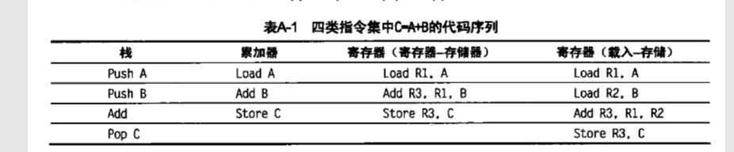


### 2.2存储器寻址(386页)

一个体系结构需要定义如何解释存储器以及如何指定这些地址


##### （1）解释存储器地址

也就是说，根据地址和长度会访问到什么对象呢？本书中讨论的所有指令都是字节寻址的。


@@@关于字节顺序

提供对字节（8bit），半字，字，双字（64bit）

小端字节顺序，大端字节顺序。

```
举例来说，数值0x2211使用两个字节储存：高位字节是0x22，低位字节是0x11。
大端字节序：高位字节在前，低位字节在后，这是人类读写数值的方法。
小端字节序：低位字节在前，高位字节在后，即以0x1122形式储存。
```

计算机电路先处理低位字节，效率比较高，因为计算都是从低位开始的。所以，计算机的内部处理都是小端字节序。


@@@寻址时对齐

非对齐寻址会增加硬件的复杂性。一个非对齐存储器的寻址可能需要多个对齐的存储器的引用。

因此即使在允许非对齐寻址的计算机中采用对齐寻址的程序也可以运行得更快一些。

```
下面列出了在Microsoft，Borland，GNU上对于X86架构32位系统的结构体成员各种类型的默认对齐方式。
char(1字节)，1字节对齐
short(2字节)，2字节对齐
int(4字节)，4字节对齐
float(4字节)，4字节对齐
double(8字节)，Windows系统中8字节对齐，Linux系统中4字节对齐
      当结构体某一成员后面紧跟一个要求比较大的地址对齐成员时(例如char成员变量后面跟一个double成员变量)，或是在，这时要插入一些没有实际意义的填充(Padding)。而且总的结构体大小必须为最大对齐的倍数。
下面是一个有char,int,short三种类型，4个成员组成的结构体，该结构体在还未编译之前是大小占8个字节。
struct AlignData
{
    char a;
    short b;
    int c;
    char d;
};

编译之后，为了保持结构体中的每个成员都是按照各自的对齐，编译器会在一些成员之间插入一些padding，因此编译后得到如下的结构体：
struct AlignData 
{
    char a;
    char Padding0[1]; 
    short b;
    int c;  
    char d;
    char Padding1[3]; 
};
编译后该结构体的大小为12个字节，最后一个成员d后面填充的字节数要使该结构体的总大小是其成员类型中拥有最大字节数的倍数(int拥有最大字节数)，因此d后面要填充3个字节。
```


##### （2）寻址方式

寻址方式即体系结构如何指定要访问对象的地址。除了存储器中的位置之外，寻址方式还指定常量和寄存器。

在使用存储器位置时，由寻址方式指定的实际存储器地址称为有效地址。

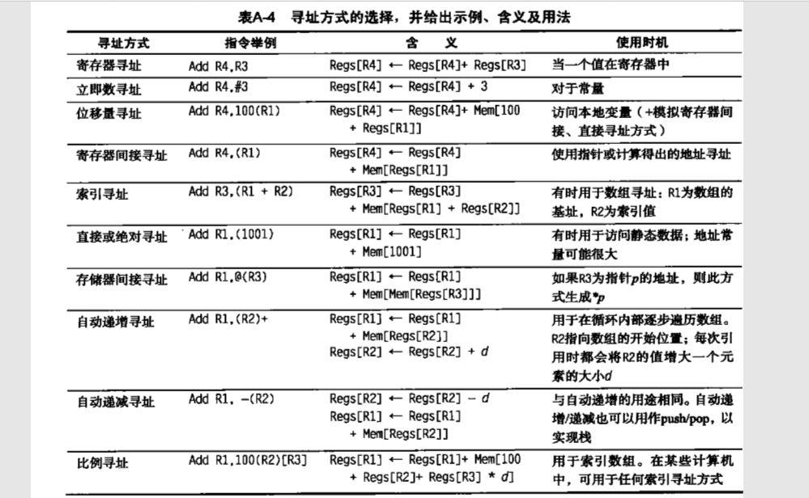

位移量寻址和立即数寻址是使用频率最高的两个寻址方式。


@@@位移量寻址方式：

一个主要问题就是位移量的范围。可以决定支持的位移量大小，位移量大小直接影响到指令长度。

@@@立即数寻址方式

是否需要对所有运算都支持立即数还是只对一部分运算支持。

立即数的取值范围。


##### （3）操作数的类型和大小

如何指定操作数的类型呢？通过在操作码中进行编码来指定操作数的类型。

现在几乎所有计算机都遵循相同的浮点标准IEEE标准754

对于一些商务应用程序，由于十进制的小数转成二进制可能会出现二进制并不能准确表示十进制小数的问题

所以一些体系结构支持一种叫压缩十进制或二进制编码十进制--即用四个位对0到9进行编码


（4）指令集中的操作

关于所有体系结构的一条经验规律：执行最多的指令是一个指令集中的简单操作。

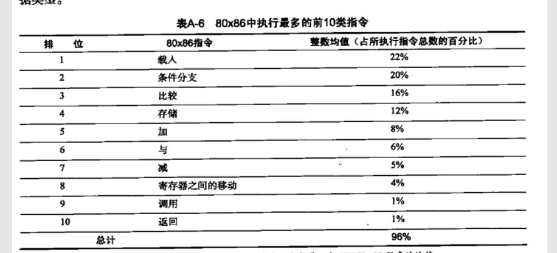


##### （5）控制流指令

四种不同类型的控制流变化：

条件分支，跳转，过程调用，过程返回。

当控制中的改变有条件的时候是分支，无条件的时候是跳转。


@@@控制流指令的寻址方式

控制流中的目标地址在任何情况下都必须指定。在绝大多数情况下它被明确指定。但过程返回是一个重要的例外。

指定目标的常见方法是提供一个将被加到程序计数器（PC）中的位移量。这类控制流指令被称为PC相对指令。

但如果在编译时不知道目标位置，为了实现返回和跳转需要一种新的寻址方式。这种动态寻址方式可能非常简单，只需要给出包含目标地址的寄存器名称即可。


由于分支通常使用PC相对寻址来指定其目标，一个重要的问题就是关注分支目标距离分支有多远 。


@@@条件分支选项

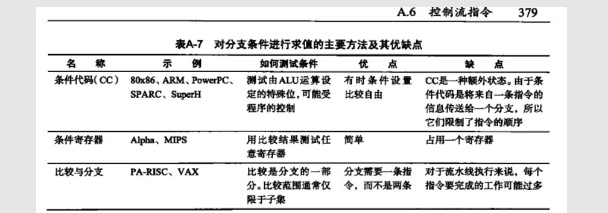


@@@过程调用选项


（6）指令集编码（397页）

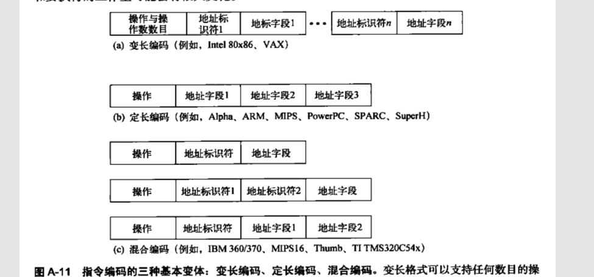


（7）RISC中的精简代码

嵌入式应用程序中的成本和缩短代码非常重要。所以RISC指令集有一种新的混合版本，同时支持16位和32位。


（8）MIPS体系结构

@@@MIPS的寄存器

32个64位通用寄存器

还有一组32位浮点寄存器

R0的值总是0


@@@MIPS的数据类型：

8，16，32，64    32位单精度浮点数，64位双精度浮点数


@@@MIPS的寻址方式：

立即数寻址和位移量寻址。均采用16位字段


@@@谬论：

#设计专门支持高级语言结构的“高级”指令集功能。

#不考虑编译器，仅通过指令集体系结构缩小代码规模

#存在典型程序这种东西


## 3.流水线：

（三阶段：取指，分析，执行）

（load从内存到寄存器）

（1）流水线指令运行时间的计算：公式：


第一项相当于是把各项加起来，第二项的tj是最慢的一段的执行时间。


我们光看公式就几个变量，不好理解，我们来看例题：


很简单的一道题目，我们看的出来，很容易我们就计算的出来：（2+2+1）+（100-1）*2=203


（2）流水线的吞吐率

TP=n/Tk

n是任务数，Tk是执行的总时间。

还是上面那个例题


答案:任务数/执行时间=100/203


（3）流水线的加速比
完成同样的任务，不使用流水线所用的时间与使用流水线所用的时间之比。


（6+7+8+9+6）* n/（（6+7+8+9+6）+9* n）=4（极限的思想）


（4）流水线的效率
流水线的设备利用率，公式是：


和加速比之间的关系：加速比/k（流水线段数）。


（5）RISC流水线的五个周期


IF-ID-EX-MEM-WB

@@@指令提取周期（IF）					用到存储器

将PC发送到存储器，从存储器提取当前指令。向程序计数器中加4（每条指令的长度是4个字节），将程序更新到下一个连续程序计数器。


@@@指令译码/寄存器提取周期（ID）要用到寄存器

对指令进行译码，并从寄存器堆中读取与寄存器源说明符相对应的寄存器。在读取寄存器时对其进行相等测试，以确定是否是分支。必要时还要对指令的偏移量字段进行符号扩展。符号扩展后的偏移量添加到所实现的程序计数器上，计算出可能的分支目标地址。

指令译码与寄存器的读取是并行执行的。


@@@执行/有效地址周期（EX）		ALU

ALU对上一周期准备的操作数进行操作，根据指令类型执行三类指令之一。

存储器引用 --- ALU将基址寄存器和偏移量加到一起，形成有效地址。

寄存器-寄存器ALU指令---ALU对读自寄存器堆的值执行由ALU操作码指定的操作。


@@@存储器访问（MEM）		读取存储器的数据，或往存储器中写入数据

如果该指令是一条载入指令，则使用上一周期计算的有效地址从存储器中读取数据。如果是一条存储指令，则使用有效地址将从寄存器堆的第二个寄存器读取的数据写入存储器。


@@@写回周期（WB）				写回寄存器堆

寄存器-寄存器ALU指令或载入指令。

将结果写入寄存器堆，无论是来自寄存器系统（对于载入指令），还是来自ALU（对于ALU指令）。


（6）主要功能单元是在不同周期使用的，因此多条指令的执行重叠不会引入多少冲突。


##### （7）流水线的冒险

@@@结构冒险：在重叠执行模式下，如果硬件无法同时支持指令的所有可能组合方式，就会出现资源冲突，从而造成结构冒险。

@@@数据冒险：如果一条指令取决于先前指令的结果

@@@控制冒险：分支指令以及其他程序计数器的指令实现流水化时可能导致控制冒险。

为了避免冒险，经常要求在流水线中的一些指令延迟时，其他一些指令能够继续执行。对于本附录中讨论的流水线，当一条指令被停顿时，在停顿指令之后发射的所有指令也被停顿。


结构冒险：

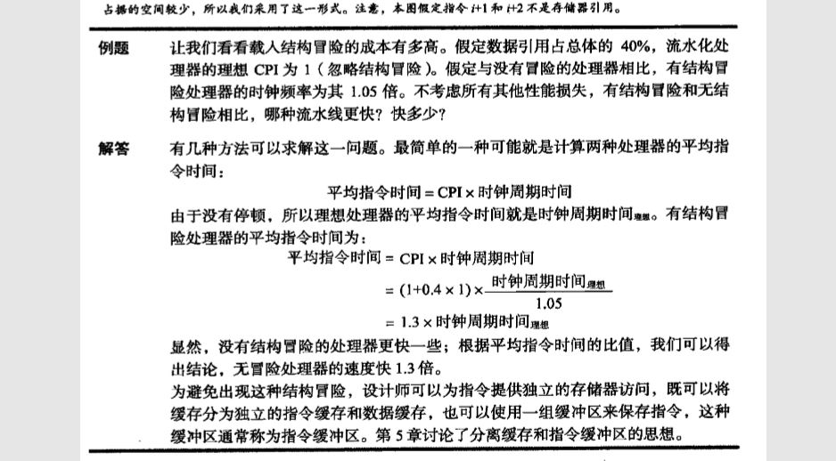


数据冒险：

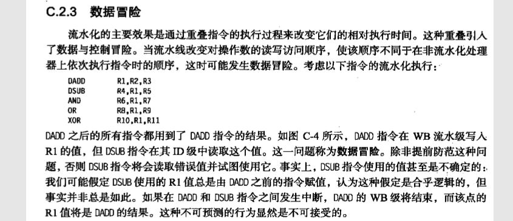


##### （8）流水线冒险的解决办法：

@@@解决数据冒险：

转发技术或称作支路：就是说其实EX阶段就已经算完了。

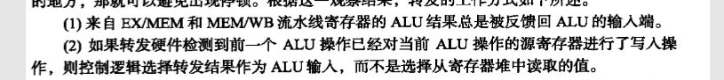


需要停顿的数据冒险：

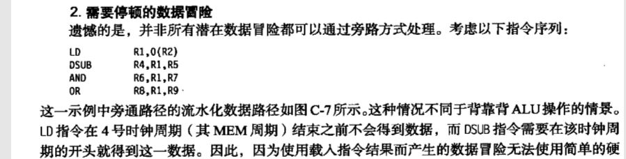


（9）WAW，RAW（写后读），WAR（读后写）

RAW：后面的指令尝试在前一条指令写入之前读出寄存器内容

WAW：后一条指令比前一条指令先写寄存器

WAR：后面的指令在前一条指令读数据之前就写入数据


## 4.计算机性能相关

MIPS:百万条指令数每秒 MIPS:百万条指令数每秒
CPI :每条指令执行的平均时间周期数=执行程序的时钟周期数/IC
IC:所执行的指令条数
IPS:每秒执行的指令条数


CPU时间即反映CPU全速工作时完成该进程所花费的时间


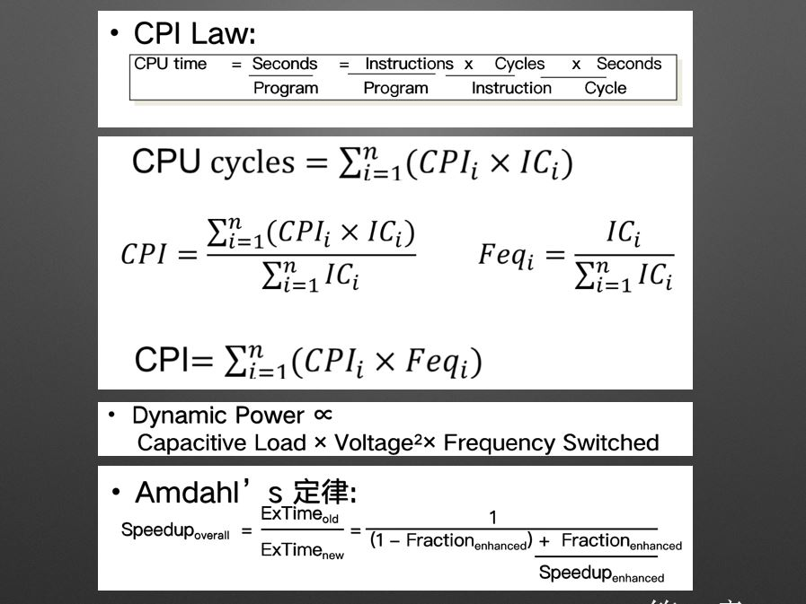


## 5.分支预测

静态分支预测
　　最简单的静态分支预测方法就是任选一条分支。这样平均命中率为50%。更精确的办法是根据原先运行的结果进行统计从而尝试预测分支是否会跳转。


动态分支预测

```
  BHT——Branch History Table，顾名思义，这是记录分支历史信息的表格，用于判定一条分支指令是否token；
所以一般就用指令的后12位作为BHT表格的索引，这样用4Kbit的一个表格，就可以记录branch history了。当然，通过大伙的不懈努力和分析，发现在BHT中用1bit位记录分支是否跳转还不够准确，用2bit位记录就非常好了，而用3bit或者更多位记录，效果与2bit类似。所以在BHT中，一般就用2bit位记录分支是否跳转：例如11和10表示这条分支会跳转；01和00表示分支不会跳转。这个2bit计数器大伙叫做饱和计数器。
```


## 6.GPU


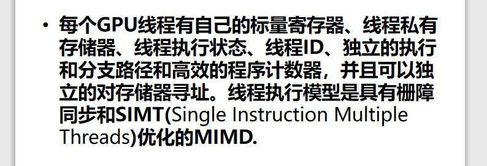


7.

RISC:精简指令集计算机(RISC:Reduced Instruction Set Computing RISC)

​			是一种执行较少类型计算机指令的微处理器


CISC:复杂指令集计算机（CISC）体系结构的设计策略是使用大量的指令，包括复杂指令。

与其他设计相比，在CISC中进行程序设计要比在其他设计中容易，因为每一项简单或复杂的任务都有一条对应的指令。程序设计者不需要写一大堆指令去完成一项复杂的任务。 但指令集的复杂性使得CPU和控制单元的电路非常复杂。

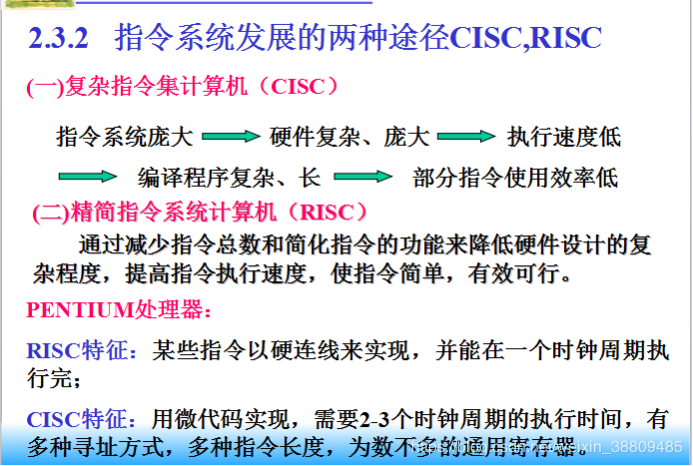


## 8.缓存


脏块：脏数据是在缓存中被修改过但是还没有被写回的数据。

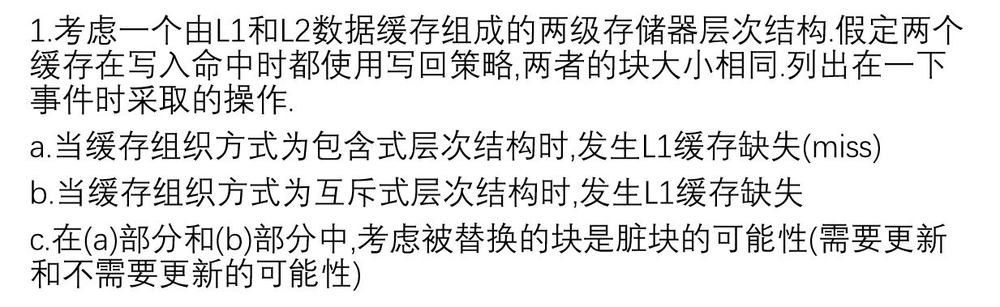


写直达法：写到cache，并写到下一级存储器（主存）；简单易实现；

2.       写回法：只把信息写到cache，该块被替换时再写到主存；速度快，存在不一致性；
读优化：在读出标识进行比较的同时，把相应的块读出。如果命中，立即将该块送到CPU；如果失效，则读出的块没有作用，置之不理即可；


## 9. Tomasulo 算法

（1）Qi 表明哪个保留站将产生该寄存器的值

（2）

```
Tomasulo法和记分牌法的异同
相同之处：
两者消除RAW竞争的思想相同。Tomasulo方法采用了记分牌方法的动态调度的核心思想，多条指令处于发射状态，等待条件成熟，可以不按顺序执行，不按顺序完成的思想，即为动态调度来消除RAW竞争。
不同之处：
Tomasulo方法通过寄存器换名过程可以消除WAR和WAW竞争。
记分牌方法能检测WAR和WAW竞争，一旦检测到存在WAR和WAW竞争，通过插入停顿周期来解决这一竞争。所以，记分牌方法不能消除WAR和WAW竞争。
硬件组织上有两点不同：
1.检测竞争和控制指令执行方式的不同：
Tomasulo方法检测竞争和控制指令执行两方面功能是通过分布在每一功能单元的保留站来进行的，因此Tomasulo方法是一种分布式方法。
记分牌方法的上述功能是通过统一的记分牌来实现的，因此记分牌方法是一种集中式方法。
2.写结果的方法不同：
Tomasulo方法通过CDB直接将功能单元输出的结果送往需要该结果的所有保留站，而不必经过寄存器这一中间环节。
记分牌方法是将结果写入FP寄存器, 因而可能造成等待这一结果的指令都出现停顿现象，之后，所有相关指令的功能单元在读FP 寄存器时又可能出现竞争现象。
Tomasulo方法的流水级功能与记分牌比较：
Tomasulo方法中无检查WAW和WAR竞争功能，因为在指令发射过程中，由issue logic结合保留站完成了register operands的改名过程，即消除了这两种竞争。
CDB起到广播结果的作用，不必通过register file直接结果送到所有需要该结果的保留站和buffers.
Load和Store buffers相当于基本功能单元
```


## 10.监听协议MSI

```
Modified（已修改）：块已在缓存中已被修改，缓存中的数据与后备存储器（例如内存）中的数据不一致。具有“M”状态的块的缓存在该块被替换时需要将其中的内容写回后备存储。
Shared（共享）：块未被修改，并在至少一个处理器的缓存中以只读状态存在。高速缓存可以将其替换而不将其中的数据写回后备存储。
Invalid（无效）：该块不存在于当前缓存中，或者因为总线请求而被标记为无效。如果要将某个块存储在该缓存中，则必须首先从内存或另一个高速缓存中获取该块。
```


```
处理器向高速缓存发出的请求包括：
PrRd：处理器请求读取一个缓存块。
PrWr：处理器请求改写一个缓存块。
状态图的总交易MSI协议。
此外，还有总线方面的请求。 包括：
BusRd：当某个处理器的高速缓存的读操作出现未命中，它会向总线发送一个BusRd请求，并预期能够收到该缓存块的数据。
BusRdX：当某个处理器的高速缓存的写操作出现未命中，它会向总线发送一个BusRdX请求，预期能够收到该缓存块的数据，并且使其他处理器中对应相同地址的缓存块无效。
BusUpgr：当某个处理器的高速缓存的写操作命中时，它它会向总线发送一个BusUpgr，使其他处理器中对应相同地址的缓存块无效。
Flush：该请求表明一个缓存块正在被写回内存。
```


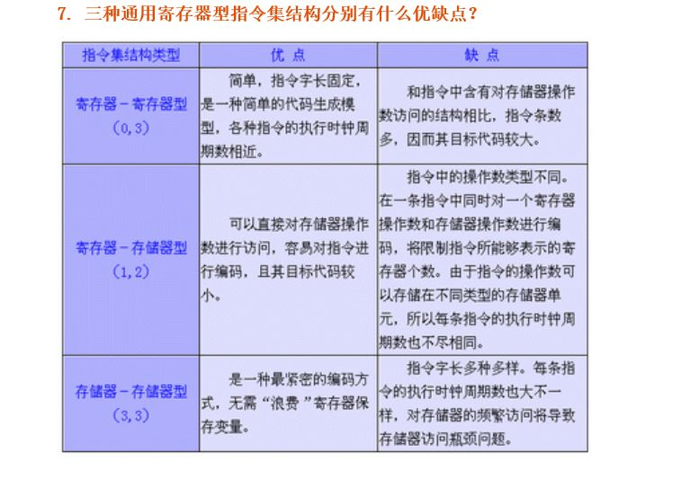


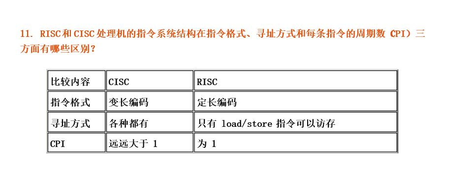


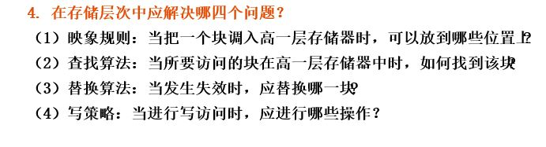


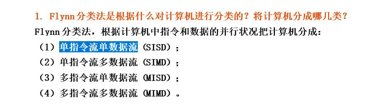

单指令流多数据流（英语：Single Instruction Multiple Data，缩写：SIMD）是一种采用一个控制器来控制多个处理器，同时对一组数据（又称“数据向量”）中的每一个分别执行相同的操作从而实现空间上的并行性的技术。


单指令流单数据流（英文：Single instruction, Single data，缩写：SISD），每个指令部件每次仅译码一条指令，而且在执行时仅为操作部件提供一份数据。


MIMD计算机具有多个异步和独立工作的处理器。在任何时钟周期内，不同的处理器可以在不同的数据片段上执行不同的指令，也即是同时执行多个指令流，而这些指令流分别对不同数据流进行操作。


MISD具有n个处理单元，按n条不同指令的要求对同一数据流及其中间结果进行不同的处理。一个处理单元的输出又作为另一个处理单元的输入。


```
监听式
监听式缓存一致性模型类似一种自治的协议。每一个处理器都需要监听总线上的信息。当一个处理器需要对缓存进行写的时候，会向总线发送失效信号。其他处理器监听到这个消息的时候，会根据这个信号进行状态转移。

目录式
目录式则拥有一个中央目录控制的角色。原来向总线发送的的消息改为向目录持有者发送消息。而目录持有者负责改变每个处理器上缓存数据的状态。这样可以减少总线的使用。

**目录法需要占据更多的储存空间。但是对总线的使用较少，适合于分布式系统。**
```


14. 
实现Cache一致性协议有哪两类？

(1) 写作废协议：在一个处理器写某个数据项之前保证它对该数据项有唯一的访问权。
(2) 写更新协议：当一个处理器写某数据项时，通过广播使其它Cache中所有对应的该数据项拷贝进行更新。
  