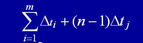
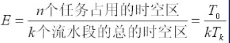
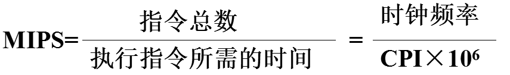

1.各机器级的实现主要靠翻译和解释或两者结合进行。
翻译是先用转换程序将高一级机器级上的程序整个地变换成低一级机器级上等效的程序，然后再在低一级机器级上实现的技术。
解释则是在低级机器上用它的一串语句或指令来仿真高级机器上的一条语句或指令的功能，是通过对高级的机器级语言程序中的每条语句或指令逐条解释来实现的技术。

## 2.1 ISA的基本概念	(26页)

指令集体系结构 Instruction Set Architecture

（1）ISA分类

寄存器-储存器ISA：可以在许多指令中访问储存器

载入-存储ISA：只能用载入或者存储指令来访问储存器

所有最新的ISA都采用载入储存版本

（2）储存器寻址

所有桌面计算机和服务器计算机都采用字节寻址方式来访问储存器操作数

如果操作数是对齐的，访问速度会快一些。

（3）寻址模式

除了指定寄存器和常量操作数之外，寻址模式还指定了一个储存器对象的地址。

MIPS寻址模式为：寄存器寻址，立即数寻址和位移量寻址。

（4）操作数的类型和大小

大多数ISA： 8位(ASCII字符)，16位(Unicode或半个字)，32位（整数或字），64位（双字或长整型）。

（5）操作指令：

常见的操作类别为：数据传输指令，算术逻辑指令，控制指令，浮点指令。

@数据传输：在寄存器和储存器之间，或者在整数和FP或特殊寄存器之间移动数据，唯一的存储器寻址模式是16位位移量加上GPR（通用寄存器）的内容

@算术/逻辑：对GPR中的整数或逻辑数据进行操作，带符号算术运算溢出时进行陷阱捕获

@控制：控制分支和跳转，相对于PC寄存器或通过寄存器控制

@浮点：对单精度双精度浮点数进行操作

（6）控制流指令：

几乎所有ISA，包括上述三种在内，都支持条件转移，无条件跳转，过程调用和返回。所有这三种都使用相对于PC的寻址方式，其中的分支地址由一个地址字段指定，该地址将被加到PC。

（7）ISA编码： 有两种选择：固定长度和可变长度。80x86编码为可变长度，ARM和MIPS指令的长度固定32位。可变长度的指令可以占用较少的空间。所以ARM和MIPS后来都进行了拓展，支持16位，以便缩小程序规模。

## 2.2 ISA的功能设计（382页）

## 3.流水线：

（三阶段：取指，分析，执行）

（1）流水线指令运行时间的计算：公式：

第一项相当于是把各项加起来，第二项的tj是最慢的一段的执行时间。

我们光看公式就几个变量，不好理解，我们来看例题：

很简单的一道题目，我们看的出来，很容易我们就计算的出来：（2+2+1）+（100-1）*2=203

（2）流水线的吞吐率

TP=n/Tk

n是任务数，Tk是执行的总时间。

还是上面那个例题

答案:任务数/执行时间=100/203

（3）流水线的加速比
完成同样的任务，不使用流水线所用的时间与使用流水线所用的时间之比。

（6+7+8+9+6）* n/（（6+7+8+9+6）+9* n）=4（极限的思想）

（4）流水线的效率
流水线的设备利用率，公式是：

和加速比之间的关系：加速比/k（流水线段数）。

## 4.计算机性能相关

MIPS:百万条指令数每秒 MIPS:百万条指令数每秒
CPI :每条指令执行的平均时间周期数=执行程序的时钟周期数/IC
IC:所执行的指令条数
IPS:每秒执行的指令条数

CPU时间即反映CPU全速工作时完成该进程所花费的时间

