作者：大大纸飞机
链接：https://www.jianshu.com/p/cf7dba86c391
来源：简书
著作权归作者所有。商业转载请联系作者获得授权，非商业转载请注明出处。


## 为什么要用B树和B+树：

计算机的发展速度很快，CPU、内存、显卡等已不再是计算机性能的瓶颈，SSD硬盘的出现也使得硬盘读写速度有了质的飞跃，但和内存相比依然有极大的差距，这就意味着我们在内存环境下设计的算法，在涉及到硬盘读写时效率会极大地降低。比如红黑树、AVL树等，因为其每个结点只能存储一个数据，且每个结点最多有两个子结点，这意味着当数据很多时，树的高度会非常大，也就意味着要频繁地进行IO操作。即使是普通的树，每个结点可以有多个孩子，那它要么度非常大，要么高度特别大，也可能两者都特别大，也无法摆脱频繁IO操作带来的性能瓶颈。今天要研究的B树和B+树就是这种频繁IO操作场景的解决办法。


# B树

算法导论书上也有关于B树的内容


### 多路查找树定义:

1.我们首先要知道多路查找树的概念，它的定义如下：

```
多路查找树（multi-way search tree），其每一个结点的孩子数可以多于两个，
且每一个结点处可以存储多个元素。
```


2.和普通的树相比，多路查找树一个节点不再是只能存储一个元素，这打破了我们对树的理解，但是正是这个特性，使得它能够出色地解决IO问题。我们要研究的B树就是一棵多路查找树，它的定义如下：

```
B树是一种平衡的多路查找树，结点最大的孩子数目称为B树的阶（Order）。
```


### B树的定义:

3.一个m阶的B树具有如下属性：

（所以一个m阶的B树，每个结点最多只有m-1个元素）

- 如果根结点不是叶结点，则其至少有两棵子树。

- 每一个非根的分支结点都有k-1个元素和k个孩子，其中[m/2]≤ k ≤ m。每一个叶子结点 n 都有k-1个元素，其中[m/2]≤ k ≤ m。(每个分支结点的k是可以不同)

- 所有叶子结点都位于同一层次。

- 所有分支结点包含下列信息数据( n, A0, K1, A1, K2, A2, …, Kn, An )，其中: Ki( i=1, 2, …, n ) 为关键字，且Ki<Ki+1( i=1, 2, …, n-1 ); Ai ( i=0, 2, …, n) 为指向子树根结点的指针，且指针Ai-1所指子树中所有结点的关键字均小于Ki( i=1, 2, …, n ) ，An 所指子树中所有结点的关键字均大于Kn，n ( [m/2]-1 ≤ n ≤ m-1 ) 为关键字的个数(或 n+1 为子树的个数)。


4.这段定义一定让人感到费解吧，那我们就从B树的一个特例：2-3树作为切入点，

来看看一个B树是如何构建和操作的。

```
2-3树是这样的一棵多路查找树：其中的每一个结点都具有两个孩子（称为2结点）或三个孩子（称为3结点）。
2-3树就是3阶的B树
```


##### 它拥有如下属性：

```
（1）一个2结点包含一个元素和两个孩子（或没有孩子），和二叉排序树一致，左子树包含的元素小于该元素，右子树包含的元素大于该元素。但是这个2结点要么有两个孩子，要么没有孩子，不能只有一个孩子。
（2）一个3结点包含两个元素和三个孩子（或没有孩子），左子树、较小元素、中间子树、较大元素和右子树也按照从小到大排序。一个3结点要么有三个孩子，要么没有孩子。
（3）2-3树的所有叶子结点都在同一层次上。
```


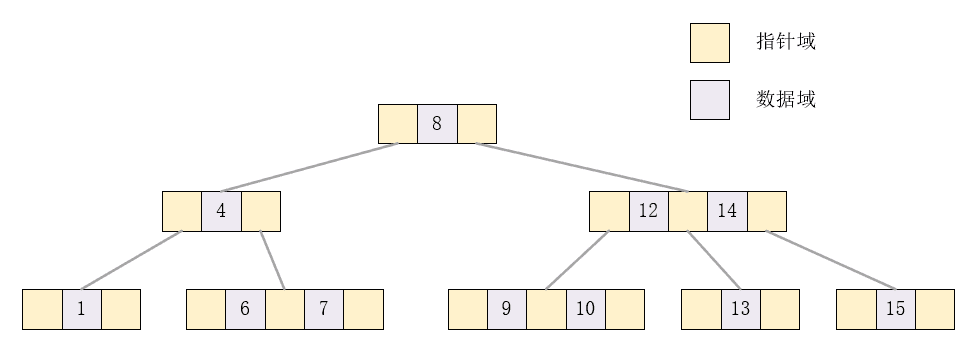


### 图解B树的插入过程:

下面我们通过构造一棵2-3树来演示它的增删过程，假定初始数据为：{1, 7, 4, 9, 15, 13, 6, 5, 8, 10, 3, 12, 14, 2, 11}。


（1）1,              7, 4, 9, 15, 13, 6, 5, 8, 10, 3, 12, 14, 2, 11

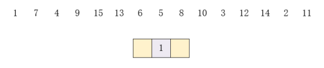


（2）1, 7，		 4, 9, 15, 13, 6, 5, 8, 10, 3, 12, 14, 2, 11

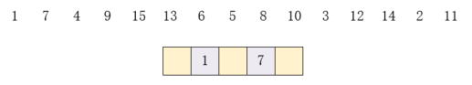


（3）1, 7, 4, 		9, 15, 13, 6, 5, 8, 10, 3, 12, 14, 2, 11

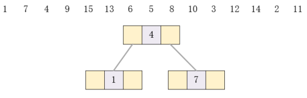


（4）1, 7, 4, 9, 		15, 13, 6, 5, 8, 10, 3, 12, 14, 2, 11

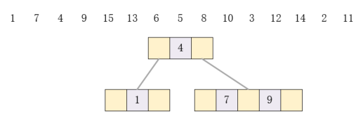


（5）1, 7, 4, 9, 15, 		13, 6, 5, 8, 10, 3, 12, 14, 2, 11

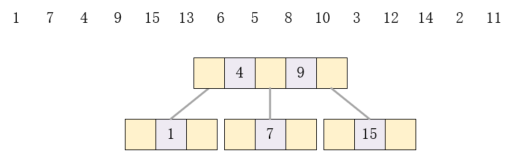


（6）1, 7, 4, 9, 15, 	13, 6,		 5, 8, 10, 3, 12, 14, 2, 11

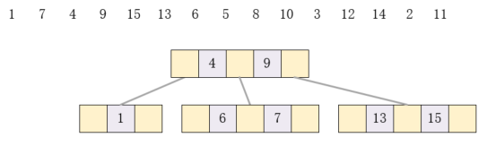

（7）1, 7, 4, 9, 15, 13, 6, 	5, 		8, 10, 3, 12, 14, 2, 11

似乎插入的时候要先找位置


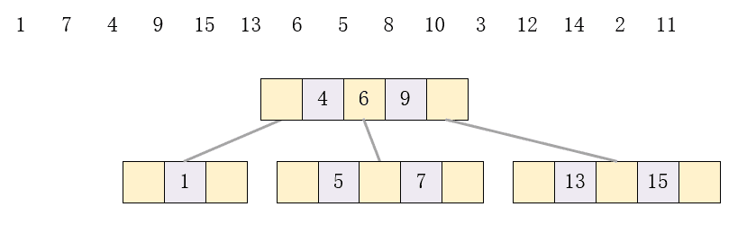

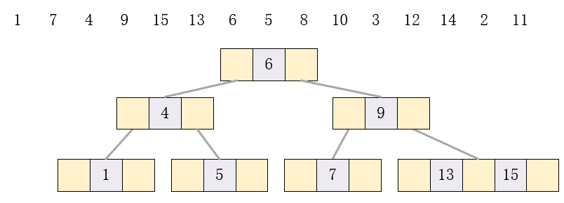


(8)1, 7, 4, 9, 15, 13, 6, 5	, 8, 10, 3, 		12, 14, 2, 11

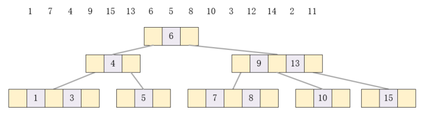

(9)1, 7, 4, 9, 15, 13, 6, 5, 8, 10, 3, 	12, 14, 2, 		11

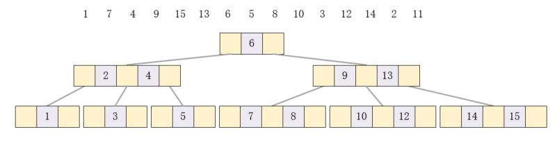

(10)1, 7, 4, 9, 15, 13, 6, 5, 8, 10, 3, 12, 14, 2, 		11

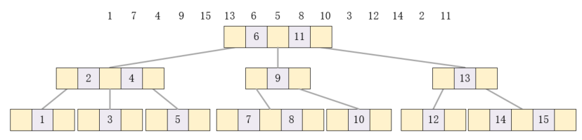


### 图解B树的删除过程：

现在倒着删除我们刚刚建好的那颗树


（1）首先删除元素1，因为1是2结点，删除后会影响平衡，但是我们发现它的父结点是一个3结点，所以可以把父结点拆开，2和3合并成一个3结点，结果如下：

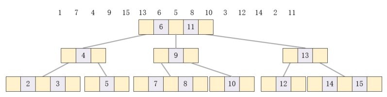

（2）1, 7,     4, 9, 15, 13, 6, 5, 8, 10, 3, 12, 14, 2,11由于7所在的是一个三结点，直接删除

（3）1, 7, 4, 		9, 15, 13, 6, 5, 8, 10, 3, 12, 14, 2,11删除4，拆分左孩子

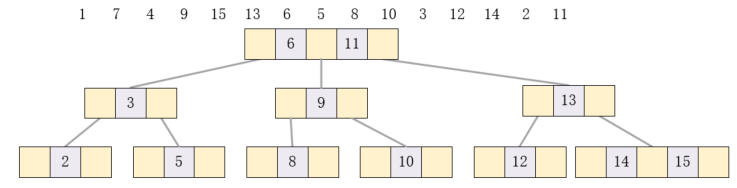

(4)1, 7, 4, 9, 		15, 13, 6, 5, 8, 10, 3, 12, 14, 2,11删除9.

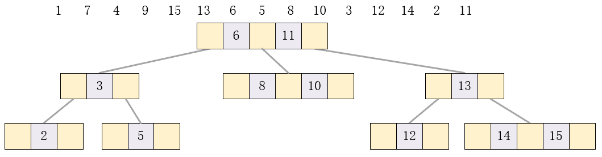

但此时所有的叶子结点不在同一层，

此时树是不平衡的，此时发现左侧3和6可以合并为3结点，结果如下：

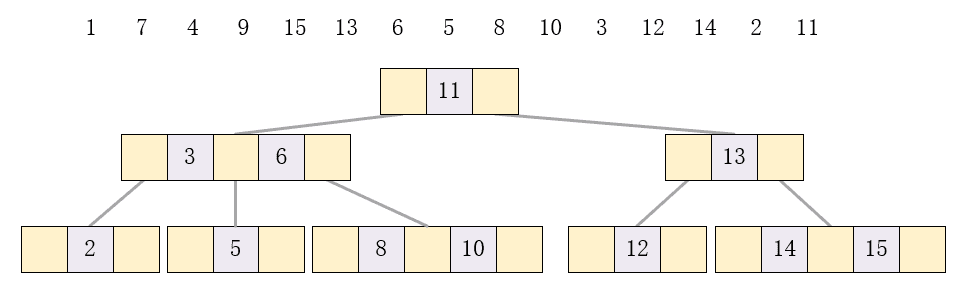

(5)15直接删除

(6)删除13也比较复杂，首先需要把它的两个孩子合并，然后以11为根结点，做类似右旋的操作，具体做法是6的右孩子成为11的左孩子，然后6成为11的父结点，这和AVL树等的右旋操作是一致的，结果如下：

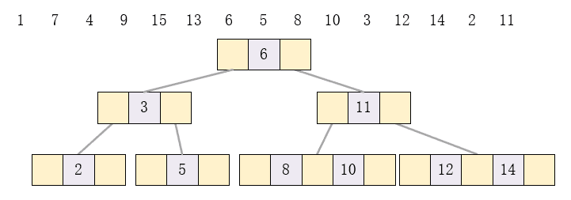

(7)接下来要删除的元素6是根结点，做法是先找到它的前驱（第一个比它小的元素）5代替它，此时2、3结点需要合并，合并后左右子树不再平衡，所以还需要5和11合并，结果如下：

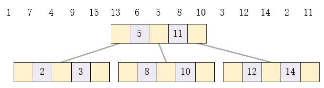


### B树上的操作（算法描述）：

每个结点x具有以下关键字：

1. x.n当前储存在结点x中的关键字个数。
2. x.n个关键字本身(x.key1<=x.key2 ..... <=x.keyn)
3. x.leaf 布尔值，是否是叶结点
4. 指向其孩子的指针x.c1, x.c2, ...... ,x.cn+1


###### （1）搜索B树

```python
	BTREE-SEARCH(x,k)
	while i<=x.n and k>x.key 	#找到i,满足x.key(i-1)<k<x.keyi
		i=i+1
	if i<=x.n and k==x.key		#找到了关键字k
		return (x,i)
	elseif x.leaf				#如果已经是叶子结点，代表B树中没有这个值
		return NULL
	else DISK-READ(x,ci)		#算法导论上这么写的，其实也就是相当于读取x.ci
		return BTREE-SEARCH(x.ci,k)
```


###### （2）向B树中插入一个关键字

|||||分裂B树中的结点

输入是一个非满的内部结点x和一个使 x.ci 为x的满子结点的下标i。（第i个指针指向一个满子结点）

该过程吧这个子结点分裂成两个，并调整x使之包含多出来的孩子。

要分裂一个满的根，首先要让根成为一个新的空根结点的孩子。树的高度会因此增加1，分裂是树长高的唯一途径

假设满孩子的数量是2t。

```python
BTREE-SPLIT-CHILD(x,i)
    x=ALLOCATE-NODE()
    y=x.ci				#y是x的第i个孩子（第i个指针），分裂后由2t个孩子，2t-1个关键字
    					#减少至t个孩子，t-1个关键字
    z.leaf=y.leaf
    z.n=t-1
    for(j=1 to t-1)
    	z.keyi=y.key i+1
    if not y.leaf
    	for j=1 to t
        	z.cj=y.cj+t	
    #前面的部分，创建结点z,并将y的t-1个关键字及相应的t个孩子给它            
    y.n=t-1				#调整y的关键字个数
    for j=x.n+1 downto i+1
    	x.cj+1=x.cj
    x.ci+1=z
    for j=x.n downto i
    	x.key j+1=x.key j	#给插入z空出位置
    x.keyi=y.keyt
    x.n=x.n+1			#将z插入为x的一个孩子
    
    DISK-WRITE(y)		#修改磁盘
    DISK-WRITE(z)
    DISK-WRITE(x)
```


|||||||沿树单程下行的方式向B树中插入关键字

```python
#向B树  T中插入关键字k
BTREE-INSERT(T,k)
	r=T.root
    if r.n==2t-1					#如果根结点满了，分裂根结点，一个新的结点成为根
    	s=ALLOCATE-NODE()
        T.root=s
        s.leaf=false
        s.n=0
        s.c1=r
        BTREE-SPLIT-CHILD(s,1)		#分裂根结点，变出三个结点，s是当前的根结点。
        BTREE-INSERT-NOTFULL(s,k)
    else BTREE-INSERT-NOTFULL(r,k)	#如果根结点没满
    

    
#向未满的结点 x中插入关键字k
BTREE-INSERT-NOTFULL(x,k)
	i=x.n
    if x.leaf						#如果是叶结点，直接插入就行了
    	while i>=1 and k<x.keyi
        	x.keyi+1 = x.keyi
            i=i-1
        x.keyi+1=k
        x.n=x.n+1
    else 							#如果不是叶结点，则必须继续沿着树下行，直到找到一个叶结点再插入
    	while i>=1 and k<x.keyi		
    		i=i-1
        i=i+1
        DISK-READ(x,ci)
        if x.ci.n== 2t-1
        	BTREE-SPLIT-CHILD(x,i)
        	if k>x.keyi
            	i=i+1
        BTREE-INSERT-NOTFULL(x.ci,k)
```
