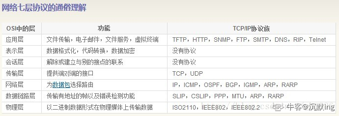

### JAVASCRIPT 和JSP不是同一个东西

1,JAVASCRIPT JavaScript 是一种新的描述语言，此一语言可以被箝入 HTML 的文件之中。透过 JavaScript 可以做到回应使用者的需求事件 (如： form 的输入) 而不用任何的网路来回传输资料，所以当一位使用者输入一项资料时，它不用经过传给伺服端 (server)处理，再传回来的过程，而直接可以被客户端 (client) 的应用程式所处理。你也可以想像成有一个可执行程式在你的客端上执行一样！目前已有一些写好的程式在Internet 上你可以连过去看看，以下有一些计算器的例子，在 Nescape 上。JavaScript 和 Java 很类似，但到底并不一样！ Java 是一种比 JavaScript 更复杂许多的程式语言，而 JavaScript 则是相当容易了解的语言。JavaScript 创作者可以不那麽注重程式技巧，所以许多 Java 的特性在 Java Script 中并不支援。

2,JSPJSP(Java Server Pages)是由Sun Microsystems公司倡导、许多公司参与一起建立的一种动态网页技术标准，JSP(Java Server Pages)是由Sun Microsystems公司倡导、许多公司参与一起建立的一种动态网页技术标准。 JSP技术是用JAVA语言作为脚本语言的，JSP网页为整个服务器端的JAVA库单元提供了一个接口来服务于HTTP的应用程序。 在传统的网页HTML文件(*.htm,*.html)中加入Java程序片段(Scriptlet)和JSP标记(tag)，就构成了JSP网页(*.jsp)。Web服务器在遇到访问JSP网页的请求时，首先执行其中的程序片段，然后将执行结果以HTML格式返回给客户。程序片段可以操作数据库、重新定向网页以及发送 email 等等，这就是建立动态网站所需要的功能。所有程序操作都在服务器端执行，网络上传送给客户端的仅是得到的结果，对客户浏览器的要求最低，可以实现无Plugin，无ActiveX，无Java Applet，甚至无Frame。  

 JSP的优点：  ·对于用户界面的更新，其实就是由 Web Server进行的，所以给人的感觉更新很快。   ·所有的应用都是基于服务器的，所以它们可以时刻保持最新版本。   ·客户端的接口不是很繁琐，对于各种应用易于部署、维护和修改

### 下面哪些类可以被继承？Java.lang.Thread、java.lang.Number、java.lang.Double、java.lang.Math、 java.lang.ClassLoader

A，Thread可以被继承，用于创建新的线程

B，Number类可以被继承，Integer，Float，Double等都继承自Number类

C，Double类的声明为class="prettyprint">public final class Double extends Number implements

Comparable<Double>它被声明成了final类，所以不能被继承。

D.Math类的声明为：  public final class Mathextends Object ，不能被继承。

E.ClassLoader可以被继承，用户可以自定义类加载器。

### 请你讲讲UML中有哪些常用的图？

在这些图形化符号中，有三种图最为重要，分别是：用例图（用来捕获需求，描述系统的功能，通过该图可以迅速的了解系统的功能模块及其关系）、类图（描述类以及类与类之间的关系，通过该图可以快速了解系统）、时序图（描述执行特定任务时对象之间的交互关系以及执行顺序，通过该图可以了解对象能接收的消息也就是说对象能够向外界提供的服务）。 

统一建模语言(Unified Modeling Language，UML)是一种为面向对象系统的产品进行说明、可视化和编制文档的一种标准语言。UML使用面向对象设计的建模工具，但独立于任何具体程序设计语言。 
作用： 
(1)为软件系统建立可视化模型。
(2)为软件系统建立构件。
(3)为软件系统建立文档。
UML系统开发中有三个主要的模型：  
功能模型：从用户的角度展示系统的功能，包括用例图。 
对象模型：采用对象，属性，操作，关联等概念展示系统的结构和基础，包括类别图、对象图。 
动态模型：展现系统的内部行为。包括序列图，活动图，状态图。 

### 你知道TCP协议、IP协议、HTTP协议分别在哪一层吗？

TCP运输层， IP网络层 ，HTTP应用层

网络七层模型： 
    物理层，数据链路层，网络层，运输层，会话层，表现层，应用层

网络五层模型： 
    物理层，数据链路层，网络层，运输层，应用层

传输层协议:UDP,TCP

应用层协议:FTP(文件传输协议),  Telnet(远程登录协议),  SMTP(电子邮件协议)   ,网络文件服务协议(NFS),

DNS(域名解析)

​       网络层协议:IP,ARP(地址解析协议)

### 关于java import xxx.*对资源的占用的说明

import xxx.*并不会对性能或资源造成影响，如果要说影响，可能就是对代码可读性的影响，比如没删除无用的引入上面总是显示灰色不太美观，或者使用*之后不能直观的看出此类引入了哪些类库等等，类似书写规范的要求。当然，有一种情况是你使用了两个类库的同名类，会导致引用矛盾，不过这种情况像idea等编辑器会直接报错。