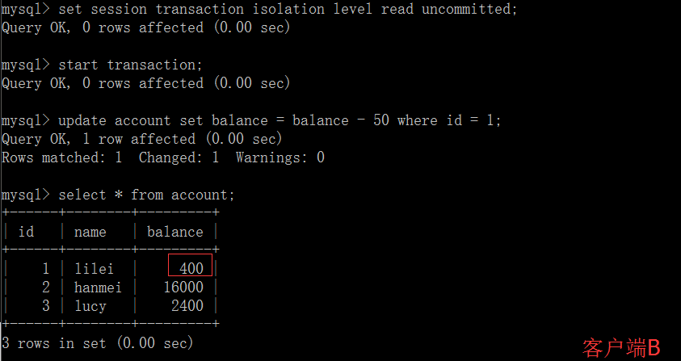

# 注：此条目下只有一些抽象的东西，具体的参考另一个仓库mysqlstudy下的数据库笔记


## InnoDB 与 MyISAM对比

1）InnoDB支持事务，MyISAM不支持，这一点是非常之重要。事务是一种高级的处理方式，如在一些列增删改中只要哪个出错还可以回滚还原，而MyISAM就不可以了。
2）MyISAM适合查询以及插入为主的应用，InnoDB适合频繁修改以及涉及到安全性较高的应用
3）InnoDB支持外键，MyISAM不支持
4）从MySQL5.5.5以后，InnoDB是默认引擎
5）InnoDB不支持FULLTEXT类型的索引
6）InnoDB中不保存表的行数，如select count() from table时，InnoDB需要扫描一遍整个表来计算有多少行，但是MyISAM只要简单的读出保存好的行数即可。注意的是，当count()语句包含where条件时MyISAM也需要扫描整个表
7）对于自增长的字段，InnoDB中必须包含只有该字段的索引，但是在MyISAM表中可以和其他字段一起建立联合索引
8）清空整个表时，InnoDB是一行一行的删除，效率非常慢。MyISAM则会重建表
9）InnoDB支持行锁（某些情况下还是锁整表，如 update table set a=1 where user like ‘％lee％’。


## 数据库的三范式:

1NF：  每个列不能分割，即原子性。（能写到数据库里面）

2NF:    满足原子性情况下，每个非主属性依赖于主键，不存在部分依赖

3NF:    在2NF下，不存在函数传递依赖。就是数据只在一个地方存储，不重复出现在多张表中，可以认为就是消除传递依赖


## 数据库的三级模式：

(1)外模式又称子模式或用户模式，对应于用户级。它是某个或某几个用户所看到的数据库的数据视图，是与某一应用有关的数据的逻辑表示。外模式是从模式导出的一个子集，包含模式中允许特定用户使用的那部分数据。也可以利用数据操纵语言(Data Manipulation Language，DML)对这些数据记录进行操作。外模式反映了数据库系统的用户观。

(2)概念模式又称模式或逻辑模式，对应于概念级。它是由数据库设计者综合所有用户的数据，按照统一的观点构造的全局逻辑结构，是对数据库中全部数据的逻辑结构和特征的总体描述，是所有用户的公共数据视图(全局视图)。它是由数据库管理系统提供的数据模式描述语言(Data Description Language，DDL)来描述、定义的。概念模式反映了数据库系统的整体观。

(3)内模式又称存储模式，对应于物理级。它是数据库中全体数据的内部表示或底层描述，是数据库最低一级的逻辑描述，它描述了数据在存储介质上的存储方式和物理结构，对应着实际存储在外存储介质上的数据库。


(4)数据库系统在三级模式之间提供了两级映像：模式/内模式的映像、外模式/模式的映像。


- 物理数据独立性:    

  如果数据库的内模式要进行修改，即数据库的存储设备和存储方法有所变化，那么模式/内模式映象也要进行相应的修改，使概念模式尽可能保持不变。**也就是对模式的修改尽量不影响概念模式。**

  应用程序与储存在磁盘上数据库的物理模式是相互独立的。

- 逻辑数据独立性:

  如果数据库的概念模式要进行修改(如增加记录类型或增加数据项)，那么外模式/模式映象也要进行相应的修改，使外模式尽可能保持不变。**也就是对概念模式的修改尽量不影响外模式和应用程序。**

  应用程序与数据库中的逻辑结构相互独立。

 

## 数据库与xml之间有什么关系？

这是风牛马不相及的两个概念，他们的结构，应用范围是完全不同的，目前的数据库基本上都是关系型数据库，以sql与oracle为代表，都是非常大型的，可以进行数据的海量存储；而xml主要解决的是数据在网上传输标准的问题，把原来各种各样的数据孤岛可以通过xml这座桥梁连接起来，所以打个比方，数据库就好比是盛数据的桶，而xml则是数据传输转换的桥梁，所以数据库是数据库，xml是xml，二者是截然不同的，当然二者也存在非常紧密的联系，毕竟都是处理数据的工具，就是很多其他的数据格式可以通过xml输入到数据库中，数据库中的关系型数据也可以通过xml转化成其他的数据格式所以，不要因为他们都与数据有关，就把他们混为一谈


## 什么是存储过程？有哪些优缺点？

- 存储过程的优点：

  （1）能够将代码封装起来保存在数据库之中让编程语言进行调用
  （2）存储过程是一个预编译的代码块，执行效率比较高
  （3）一个存储过程替代大量T_SQL语句 ，可以降低网络通信量，提高通信速率

- 缺点：

  （1)每个数据库的存储过程语法几乎都不一样，十分难以维护（不通用）

    (2)业务逻辑放在数据库上，难以迭代

  


版权声明：下面一条DQL,DML,DDL等的内容为CSDN博主「小贪玩」的原创文章，遵循CC 4.0 BY-SA版权协议，转载请附上原文出处链接及本声明。
原文链接：https://blog.csdn.net/u013544734/java/article/details/80869135

## SQL中有关DQL、DML、DDL、DCL的概念与区别

SQL结构化查询语言包含6个部分

1.数据查询语言（DQL: Data Query Language）

数据检索语句，用于从表中获取数据。通常最常用的为保留字SELECT,并且常与FROM子句、WHERE子句组成查询SQL查询语句。
语法：
    SELECT <字段名> FROM <表或视图名> WHERE <查询条件>;


2.数据操纵语言（DML：Data Manipulation Language）

主要用来对数据库的数据进行一些操作，常用的就是INSERT、UPDATE、DELETE。

语法：    INSERT INTO <表名>(列1,列2,...) VALUES (值1,值2,...);    

​				UPDATE <表名> SET <列名>=新值 WHERE <列名>=某值;    

​				DELETE FROM <表名> WHERE <列名>=某值;


3.事务处理语言（DPL）

事务处理语句能确保被DML语句影响的表的所有行及时得以更新。

DPL语句包括BEGIN TRANSACTION、COMMIT和ROLLBACK。


4.数据控制语言（DCL）

通过GRANT和REVOKE确定单个用户或用户组对数据库对象的访问权限。


5.数据定义语言（DDL）

常用的有CREATE和DROP，用于在数据库中创建新表或删除表，以及为表加入索引等。


6.指针控制语言（CCL）

它的语句，DECLARE CURSOR、FETCH INTO和UPDATE WHERE CURRENT用于对一个或多个表单独行的操作。


转自：https://www.jianshu.com/p/c82148473235

## 索引详解：

0.索引的优缺点

优势：可以快速检索，减少I/O次数，加快检索速度；根据索引分组和排序，可以加快分组和排序；
劣势：索引本身也是表，因此会占用存储空间，一般来说，索引表占用的空间的数据表的1.5倍；索引表的维护和创建需要时间成本，这个成本随着数据量增大而增大；构建索引会降低数据表的修改操作（删除，添加，修改）的效率，因为在修改数据表的同时还需要修改索引表；


#### 1.MySQL中索引的语法

创建索引

在创建表的时候添加索引

```mysql
CREATE TABLE mytable(  
    ID INT NOT NULL,   
    username VARCHAR(16) NOT NULL,  
    INDEX [indexName] (username(length))  
); 
```

在创建表以后添加索引

```mysql
ALTER TABLE my_table ADD [UNIQUE] INDEX index_name(column_name);
或者
CREATE INDEX index_name ON my_table(column_name);

alter table student add INDEX index_name(s_id);
alter table tmp_0612 add index idx_name(name);
```

注意：
1)索引需要占用磁盘空间，因此在创建索引时要考虑到磁盘空间是否足够
2)创建索引时需要对表加锁，因此实际操作中需要在业务空闲期间进行


建立索引之后仍然是用一样的查询语句，但是对大量数据而言速度会提升


#### 2.MySQL中explain查看sql语句索引使用情况 

```mysql
mysql> explain select * from user;
+----+-------------+-------+------+---------------+------+---------+------+------+-------
| id | select_type | table | type | possible_keys | key  | key_len | ref  | rows | Extra |
+----+-------------+-------+------+---------------+------+---------+------+------+-------
| 1  | SIMPLE      | user  | ALL  | NULL          | NULL | NULL    | NULL | 5    |       |
+----+-------------+-------+------+---------------+------+---------+------+------+-------
```

（1）id:

标志这个sql语句被分为几个(行数)独立的sql执行，执行顺序依照(1)从大到小(2)从上到下 依次排列执行


select_type转自https://www.cnblogs.com/danhuangpai/p/8475458.html

###### （2）select_type：查询的类型

```mysql
#select_type大致包括下面几种
+----+-------------+
| id | select_type | 
+----+-------------+
| 1 | SIMPLE       |
+----+-------------+
| 2 | PRIMARY      |
+----+-------------+
| 3 | SUBQUERY     |
+----+-------------+
| 4 | DERIVED      |
+----+-------------+
| 5 | UNION        |
+----+-------------+
| 6 | UNION RESULT |
+----+-------------+
```


- simple

  简单的SELECT语句（不包括UNION操作或子查询操作）

```mysql
   explain select * from pet where name='Bowser'
```


- PRIMARY/UNION
    PRIMARY：查询中最外层的SELECT（如两表做UNION或者存在子查询的外层的表操作为PRIMARY，内层的     	操作为UNION）

  


- DEPENDENT UNION/UNIOIN RESULT

   DEPENDENT UNION：UNION操作中，查询中处于内层的SELECT（内层的SELECT语句与外层的SELECT语句有依赖关系）
    UNION RESULT：UNION操作的结果，id值通常为NULL


-  SUBQUERY/DEPENDENT SUBQUERY
   
     SUBQUERY：子查询中首个SELECT（如果有多个子查询存在）：


DEPENDENT SUBQUERY：子查询中首个SELECT，但依赖于外层的表（如果有多个子查询存在）

  重点解释：子查询的查询方式依赖于外面的查询结果.用这个例子就是,先进行子查询外部的查询,得到一个结果集,.然后这个结果的每一行在跟select子查询的结果集进行匹配,也就是说,外部结果集的每一行都要关联内部结果集一次。而且不会进行子查询，会先进行外部查询,生成结果集,再在内部进行关联查询。这对性能极其不利，避免！


- DERIVED/MATERIALIZED
    DERIVED：被驱动的SELECT子查询（子查询位于FROM子句）
    例子 
    select aa from (select * from a) b;

-  MATERIALIZED：被物化的子查询
-  UNCACHEABLE SUBQUERY/UNCACHEABLE UNION
     UNCACHEABLE SUBQUERY：对于外层的主表，子查询不可被物化，每次都需要计算（耗时操作）
     UNCACHEABLE UNION：UNION操作中，内层的不可被物化的子查询（类似于UNCACHEABLE SUBQUERY）

- 注意
     特别关注 DEPENDENT SUBQUERY  
    1 会严重消耗性能 
   2  不会进行子查询，会先进行外部查询,生成结果集,再在内部进行关联查询 
   3 子查询的执行效率受制于外层查询的记录数 
   4 可以尝试改成join查询


(3)table:表示当前行的子查询设计的表

###### (4)type:表示查询用到了那种索引类型

```mysql
+-----+-------+-------+-----+--------+-------+---------+-------+
| ALL  | index | range | ref  | eq_ref | const | system | NULL |
| ---- | ----- | ----- | ---- | ------ | ----- | ------ | ---- |
|      |       |       |      |        |       |        |      |
+-----+-------+-------+-----+--------+-------+---------+-------+
```

从最好到最差依次是

```
system > const > eq_ref > ref > fulltext > ref_or_null > index_merge > 
unique_subquery > index_subquery > range > index > ALL
```

- system 　　表中只有一条记录，一般来说只在系统表里出现。
- const 表示通过一次索引查询就查询到了，一般对应索引列为primarykey 或者unique where语句中 指定 一个常量，因为只匹配一行数据，MYSQL能把这个查询优化为一个常量，所以非常快。
- eq_ref 唯一性索引扫描。此类型通常出现在多表的 join 查询，对于每一个从前面的表连接的对应列，当前表的对应列具有唯一性索引，最多只有一行数据与之匹配。
- ref 非唯一性索引扫描。同上，但当前表的对应列不具有唯一性索引，可能有多行数据匹配。此类型通常出现在多表的 join 查询, 针对于非唯一或非主键索引, 或者是使用了 最左前缀 规则索引的查询. 
- range 索引的范围查询。查询索引关键字某个范围的值。
- index 全文索引扫描。与all基本相同，扫描了全文，但查询的字段被索引包含，故不需要读取表中数据，只需要读取索引树中的字段。
- all 全文扫描。未使用索引，效率最低。


（5）key 和 possible key 与 key_len

- possible key 表示 MySQL 在查询时, 能够使用到的索引. 注意, 即使有些索引在 possible_keys 中出现, 但是并不表示此索引会真正地被 MySQL 使用到. MySQL 在查询时具体使用了哪些索引, 由 key 字段决定.
- key 显示MySQL实际决定使用的键(索引)。如果没有选择索引,键是NULL。
- key_len 显示MySQL决定使用的键长度。如果键是NULL,则长度为NULL。详见 https://www.cnblogs.com/zhoujinyi/p/3784450.html 
  覆盖索引：指在查询中，要查询的字段被某个索引的所有字段包含，(type一般为index),那么这个索引只出现在key中，不出现在possible key中。


（6）ref：显示索引的哪一列被使用了。
 ref 显示使用哪个列或常数与key一起从表中选择行。在eq_ref 与ref中才不为null。
 如果是使用的常数等值查询，这里会显示const，如果是连接查询，被驱动表的执行计划这里会显示驱动表的关联字段，如果是条件使用了表达式或者函数，或者条件列发生了内部隐式转换，这里可能显示为func

（7）rows
MySQL 查询优化器根据统计信息, 估算 SQL 要查找到结果集需要扫描读取的数据行数 这个值非常直观显示 SQL 的效率好坏, 原则上 rows 越少越好、


#### 3.索引的分类

常见的索引类型有：主键索引、唯一索引、普通索引、全文索引、组合索引

1) 主键索引：即主索引，根据主键pk_clolum（length）建立索引，不允许重复，不允许空值；

ALTER TABLE 'table_name' ADD PRIMARY KEY pk_index('col')；


2)唯一索引：用来建立索引的列的值必须是唯一的，允许空值

ALTER TABLE 'table_name' ADD UNIQUE index_name('col')；


3)普通索引：用表中的普通列构建的索引，没有任何限制

ALTER TABLE 'table_name' ADD INDEX index_name('col')；


4)全文索引：用大文本对象的列构建的索引

ALTER TABLE 'table_name' ADD FULLTEXT INDEX ft_index('col')；


5)组合索引：用多个列组合构建的索引，这多个列中的值不允许有空值

ALTER TABLE 'table_name' ADD INDEX index_name('col1','col2','col3')；

*遵循“最左前缀”原则，把最常用作为检索或排序的列放在最左，依次递减，组合索引相当于建立了col1,col1col2,col1col2col3三个索引，而col2或者col3是不能使用索引的。
*在使用组合索引的时候可能因为列名长度过长而导致索引的key太大，导致效率降低，在允许的情况下，可以只取col1和col2的前几个字符作为索引
ALTER TABLE 'table_name' ADD INDEX index_name(col1(4),col2（3))；
表示使用col1的前4个字符和col2的前3个字符作为索引


#### 4.索引实现的原理：

MySQL支持诸多存储引擎，而各种存储引擎对索引的支持也各不相同，因此MySQL数据库支持多种索引类型，如BTree索引，B+Tree索引，哈希索引，全文索引等等。

1）哈希索引：
只有memory（内存）存储引擎支持哈希索引，哈希索引用索引列的值计算该值的hashCode，然后在hashCode相应的位置存执该值所在行数据的物理位置，因为使用散列算法，因此访问速度非常快，但是一个值只能对应一个hashCode，而且是散列的分布方式，因此哈希索引不支持范围查找和排序的功能。

2）全文索引：
FULLTEXT（全文）索引，仅可用于MyISAM和InnoDB，针对较大的数据，生成全文索引非常的消耗时间和空间。对于文本的大对象，或者较大的CHAR类型的数据，如果使用普通索引，那么匹配文本前几个字符还是可行的，但是想要匹配文本中间的几个单词，那么就要使用LIKE %word%来匹配，这样需要很长的时间来处理，响应时间会大大增加，这种情况，就可使用时FULLTEXT索引了，在生成FULLTEXT索引时，会为文本生成一份单词的清单，在索引时及根据这个单词的清单来索引。

全文索引的查询也有自己特殊的语法，而不能使用LIKE %查询字符串%的模糊查询语法
SELECT * FROM table_name MATCH(ft_index) AGAINST('查询字符串');


###### 3）BTree索引和B+Tree索引

B-Tree有许多变种，其中最常见的是B+Tree，例如MySQL就普遍使用B+Tree实现其索引结构。

与B-Tree相比，B+Tree有以下不同点：
每个节点的指针上限为2d而不是2d+1。
内节点不存储data，只存储key；叶子节点不存储指针。
图3是一个简单的B+Tree示意。


由于并不是所有节点都具有相同的域，因此B+Tree中叶节点和内节点一般大小不同。这点与B-Tree不同，虽然B-Tree中不同节点存放的key和指针可能数量不一致，但是每个节点的域和上限是一致的，所以在实现中B-Tree往往对每个节点申请同等大小的空间。
一般来说，B+Tree比B-Tree更适合实现外存储索引结构，具体原因与外存储器原理及计算机存取原理有关，将在下面讨论。


@带有顺序访问指针的B+Tree

一般在数据库系统或文件系统中使用的B+Tree结构都在经典B+Tree的基础上进行了优化，增加了顺序访问指针。


如图4所示，在B+Tree的每个叶子节点增加一个指向相邻叶子节点的指针，就形成了带有顺序访问指针的B+Tree。做这个优化的目的是为了提高区间访问的性能，例如图4中如果要查询key为从18到49的所有数据记录，当找到18后，只需顺着节点和指针顺序遍历就可以一次性访问到所有数据节点，极大提到了区间查询效率。


@为什么使用B-Tree（B+Tree）而不是红黑树

上文说过，红黑树等数据结构也可以用来实现索引，但是文件系统及数据库系统普遍采用B-/+Tree作为索引结构，这一节将结合计算机组成原理相关知识讨论B-/+Tree作为索引的理论基础。
一般来说，索引本身也很大，不可能全部存储在内存中，因此索引往往以索引文件的形式存储的磁盘上。这样的话，索引查找过程中就要产生磁盘I/O消耗，相对于内存存取，I/O存取的消耗要高几个数量级，所以评价一个数据结构作为索引的优劣最重要的指标就是在查找过程中磁盘I/O操作次数的渐进复杂度。换句话说，索引的结构组织要尽量减少查找过程中磁盘I/O的存取次数。下面先介绍内存和磁盘存取原理，然后再结合这些原理分析B-/+Tree作为索引的效率。

@局部性原理与磁盘预读

由于存储介质的特性，磁盘本身存取就比主存慢很多，再加上机械运动耗费，磁盘的存取速度往往是主存的几百分分之一，因此为了提高效率，要尽量减少磁盘I/O。为了达到这个目的，磁盘往往不是严格按需读取，而是每次都会预读，即使只需要一个字节，磁盘也会从这个位置开始，顺序向后读取一定长度的数据放入内存。这样做的理论依据是计算机科学中著名的局部性原理：
当一个数据被用到时，其附近的数据也通常会马上被使用。
程序运行期间所需要的数据通常比较集中。
由于磁盘顺序读取的效率很高（不需要寻道时间，只需很少的旋转时间），因此对于具有局部性的程序来说，预读可以提高I/O效率。
预读的长度一般为页（page）的整倍数。页是计算机管理存储器的逻辑块，硬件及操作系统往往将主存和磁盘存储区分割为连续的大小相等的块，每个存储块称为一页（在许多操作系统中，页得大小通常为4k），主存和磁盘以页为单位交换数据。当程序要读取的数据不在主存中时，会触发一个缺页异常，此时系统会向磁盘发出读盘信号，磁盘会找到数据的起始位置并向后连续读取一页或几页载入内存中，然后异常返回，程序继续运行。


@分析

上文说过一般使用磁盘I/O次数评价索引结构的优劣。

先从B-Tree分析，根据B-Tree的定义，可知检索一次最多需要访问h个节点。数据库系统的设计者巧妙利用了磁盘预读原理，将一个节点的大小设为等于一个页，这样每个节点只需要一次I/O就可以完全载入。为了达到这个目的，在实际实现B-Tree还需要使用如下技巧：
每次新建节点时，直接申请一个页的空间，这样就保证一个节点物理上也存储在一个页里，加之计算机存储分配都是按页对齐的，就实现了一个node只需一次I/O。

B-Tree中一次检索最多需要h-1次I/O（根节点常驻内存），渐进复杂度为O(h)=O(logdN)O(h)=O(logdN)。一般实际应用中，出度d是非常大的数字，通常超过100，因此h非常小（通常不超过3）。

而红黑树这种结构，h明显要深的多。由于逻辑上很近的节点（父子）物理上可能很远，无法利用局部性，所以红黑树的I/O渐进复杂度也为O(h)，效率明显比B-Tree差很多。

由于B+Tree内节点去掉了data域，因此可以拥有更大的出度，拥有更好的性能


@总结起来就是磁盘读取时会预读页的整数倍的空间，BTree让一个结点占一个页。

而红黑树这种结构，h明显要深的多。由于逻辑上很近的节点（父子）物理上可能很远。

主要还是和树的深度有关。


事务的笔记转自https://blog.csdn.net/dengjili/article/details/82468576

## 事务:

#### 1.ACID — 数据库事务正确执行的四个基本要素。

原子性（Atomicity）
原子性是指事务是一个不可分割的工作单位，事务中的操作要么都发生，要么都不发生。

一致性（Consistency）
事务前后数据的完整性必须保持一致。事务必须是使数据库从一个一致性状态变到另一个一致性状态。

隔离性（Isolation）
与并发有关。事务的隔离性是多个用户并发访问数据库时，数据库为每一个用户开启的事务，不能被其他事务的操作数据所干扰，多个并发事务之间要相互隔离。

持久性（Durability）
持久性是指一个事务一旦被提交，它对数据库中数据的改变就是永久性的，接下来即使数据库发生故障也不应该对其有任何影响。


#### 2.一致性详解：

原子性并不能够完全保证一致性。

为了保证事务操作的原子性，必须实现基于日志的REDO/UNDO机制。

在事务处理的ACID属性中，一致性是最基本的属性，其它的三个属性都为了保证一致性而存在的。

在数据库实现的场景中，一致性可以分为数据库外部的一致性和数据库内部的一致性。前者由外部应用的编码来保证，即某个应用在执行转帐的数据库操作时，必须在同一个事务内部调用对帐户A和帐户B的操作。如果在这个层次出现错误，这不是数据库本身能够解决的，也不属于我们需要讨论的范围。后者由数据库来保证，即在同一个事务内部的一组操作必须全部执行成功（或者全部失败）。这就是事务处理的原子性。


#### 3.事务的隔离级别:

###### 	(1)悲观锁与乐观锁:

​	悲观锁

总是假设最坏的情况，每次去拿数据的时候都认为别人会修改，所以每次在拿数据的时候都会上锁，这样别人想拿这个数据就会阻塞直到它拿到锁（共享资源每次只给一个线程使用，其它线程阻塞，用完后再把资源转让给其它线程）。传统的关系型数据库里边就用到了很多这种锁机制，比如行锁，表锁等，读锁，写锁等，都是在做操作之前先上锁。

​	乐观锁
总是假设最好的情况，每次去拿数据的时候都认为别人不会修改，所以不会上锁，但是在更新的时候会判断一下在此期间别人有没有去更新这个数据，可以使用版本号机制和CAS算法实现。乐观锁适用于多读的应用类型，这样可以提高吞吐量，像数据库提供的类似于write_condition机制，其实都是提供的乐观锁。在Java中java.util.concurrent.atomic包下面的原子变量类就是使用了乐观锁的一种实现方式CAS实现的。

​	乐观锁适用于读多写少的情况。悲观锁反之。


###### 	(2)乐观锁的实现,vesion方法：

在并发的表上加一个version字段，更新的时候只有版本号大于当前版本号才能更新成功，不成功的话可能是重来

```mysql
select money，version from account where id=10 for update
money = money + 100
version = version + 1
update account set money =  money where id =10 and version > version
```


事务并发问题转自:https://www.cnblogs.com/wyaokai/p/10921323.html

###### (3)事务的并发问题:

脏读：指一个事务读取了另外一个事务未提交的数据。如果这时B事务恰巧进行了回滚事务，那么A事务读取的事务是不被承认的。（读到了没有提交的数据）

不可重复读：事务 A 多次读取同一数据，事务 B 在事务A多次读取的过程中，对数据作了更新并提交，导致事务A多次读取同一数据时，结果 不一致。（读到的数据有修改）

幻读:是指当事务不是独立执行时发生的一种现象，例如第一个事务对一个表中的数据进行了修改，比如这种修改涉及到表中的“全部数据行”。同时，第二个事务也修改这个表中的数据，这种修改是向表中插入“一行新数据”。那么，以后就会发生操作第一个事务的用户发现表中还存在没有修改的数据行，就好象发生了幻觉一样.一般解决幻读的方法是增加范围锁RangeS，锁定检索范围为只读，这样就避免了幻读。

小结：不可重复读的和幻读很容易混淆，不可重复读侧重于修改，幻读侧重于新增或删除。解决不可重复读的问题只需锁住满足条件的行，解决幻读需要锁表

感觉就算是读数据也需要缩表不让其他的session对该数据进行修改，但是可以读取该数据。


MySQL事务隔离级别

| 事务隔离级别                 | 脏读 | 不可重复读 | 幻读 |
| :--------------------------- | ---- | ---------- | ---- |
| 读未提交（read-uncommitted） | 是   | 是         | 是   |
| 不可重复读（read-committed） | 否   | 是         | 是   |
| 可重复读(repeatable_read)    | 否   | 否         | 是   |
| 串行化(serializable)         | 否   | 否         | 否   |


读未提交--->>可以读到未提交的数据

读已提交--->>只读已经提交了的数据


###### (4)事务并发问题的实际操作演示：

1. mysql默认的事务隔离级别为repeatable-read


2. 读未提交：

   （1）打开一个客户端A，并设置当前事务模式为read uncommitted（未提交读），查询表account的初始值：注意要大写！！！ SET SESSION TRANSACTION ISOLATION LEVEL read uncommitted;

   

   

   （2）在客户端A的事务提交之前，打开另一个客户端B，更新表account：

   

   

   （3）这时，虽然客户端B的事务还没提交，但是客户端A就可以查询到B已经更新的数据：

   

   

   （4）一旦客户端B的事务因为某种原因回滚，所有的操作都将会被撤销，那客户端A查询到的数据其实就是脏数据：

   

   

   （5）在客户端A执行更新语句update account set balance = balance - 50 where id =1，lilei的balance没有变成350，居然是400，是不是很奇怪，数据不一致啊，如果你这么想就太天真 了，在应用程序中，我们会用400-50=350，并不知道其他会话回滚了，要想解决这个问题可以采用读已提交的隔离级别

   
   
3. 可重复读：

   （1）打开一个客户端A，并设置当前事务模式为repeatable read，查询表account的所有记录

   （2）在客户端A的事务提交之前，打开另一个客户端B，更新表account并提交

   （3）在客户端A查询表account的所有记录，与步骤（1）查询结果一致，没有出现不可重复读的问题

   （4）在客户端A，接着执行update balance = balance - 50 where id = 1，balance没有变成400-50=350，lilei的balance值用的是步骤（2）中的350来算的，所以是300，数据的一致性倒是没有被破坏。可重复读的隔离级别下使用了MVCC机制，select操作不会更新版本号，是快照读（历史版本）；insert、update和delete会更新版本号，是当前读（当前版本）。

4. 串行化：

   同时开启两个客户端update,后操作的那个会挂起，直到前一个事务提交之后它才能完成update。

   这样有可能会出现死锁。

5. 　补充：

      　	1）事务隔离级别为读提交时，写数据只会锁住相应的行
      　　2）事务隔离级别为可重复读时，如果检索条件有索引（包括主键索引）的时候，默认加锁方式是next-key 锁；如果检索条件没有索引，更新数据时会锁住整张表。一个间隙被事务加了锁，其他事务是不能在这个间隙插入记录的，这样可以防止幻读。
      　　3）事务隔离级别为串行化时，读写数据都会锁住整张表
      　　 4）隔离级别越高，越能保证数据的完整性和一致性，但是对并发性能的影响也越大。


深入理解锁转自：https://zhuanlan.zhihu.com/p/52678870

## 深入理解数据库中的锁：

锁在数据网络传输中是一个非常重要的概念，当多个用户对数据库进行操作时，会带来数据不一致的情况，所以，锁主要是在多用户情况下保证数据库数据完整性和一致性。

数据库中还有很多其它的锁，总结一下大概有如下：悲观锁、乐观锁、表锁、行锁、临间锁、间隙锁、记录锁、共享锁、排他锁、意向共享锁、意向排他锁。


（1）行锁：
顾名思义，行锁就是一锁锁一行或者多行记录，mysql的行锁是基于索引加载的，所以行锁是要加在索引响应的行上，即命中索引。行锁的特征：锁冲突概率低，并发性高，但是会有死锁的情况出现。

（2）表锁：

顾名思义，表锁就是一锁锁一整张表，在表被锁定期间，其他事务不能对该表进行操作，必须等当前表的锁被释放后才能进行操作。表锁响应的是非索引字段，即全表扫描，全表扫描时锁定整张表，sql语句可以通过执行计划看出扫描了多少条记录。由于表锁每次都是锁一整张表，所以表锁的锁冲突几率特别高，表锁不会出现死锁的情况。

更新条件如果是带索引的字段就会用行锁，如果是不带索引的字段就会用表锁。

（3）记录锁：（仅锁一条记录）

记录锁锁的是表中的某一条记录，记录锁的出现条件必须是精准命中索引并且索引是唯一索引，如主键id。

（4）间隙锁：

间隙锁又称之为区间锁，每次锁定都是锁定一个区间，隶属行锁。既然间隙锁隶属行锁，那么，间隙锁的触发条件必然是命中索引的，当我们查询数据用范围查询而不是相等条件查询时，查询条件命中索引，并且没有查询到符合条件的记录，此时就会将查询条件中的范围数据进行锁定(即使是范围库中不存在的数据也会被锁定)，我们通过代码演示一下：

首先，我们打开两个窗口，在窗口A中我们根据id做一个范围更改操作，不提交事务，然后在范围B中插入一条记录，该记录的id值位于窗口A中的条件范围内，我们看看运行效果：


如上所示，程序报错：Lock wait timeout exceeded; try restarting transaction 。这就是间隙锁的作用。间隙锁只会出现在可重复读的事务隔离级别中，mysql5.7默认就是可重复读。间隙锁锁的是一个区间范围，查询命中索引但是没有匹配到相关记录时，锁定的是查询的这个区间范围，上述代码中，所锁定的区间就是 (1,3]这个区间,不包含1，但是包含3，并且不包含4，也就是说这里是一个左开右闭的区间。

产生间隙锁的条件（RR事务隔离级别下；）：
使用普通索引锁定；
使用多列唯一索引；
使用唯一索引锁定多行记录。

在普通索引列上，不管是何种查询，只要加锁，都会产生间隙锁，这跟唯一索引不一样；
在普通索引跟唯一索引中，数据间隙的分析，数据行是优先根据普通索引排序，再根据唯一索引排序。


(5)临键锁：

mysql的行锁默认就是使用的临键锁，临键锁是由记录锁和间隙锁共同实现的，上面我们学习间隙锁时，间隙锁的触发条件是命中索引，范围查询没有匹配到相关记录。而临键锁恰好相反，临键锁的触发条件也是查询条件命中索引，不过，临键锁有匹配到数据库记录；

(6)共享锁【S锁】--读锁:
又称读锁，若事务T对数据对象A加上S锁，则事务T可以读A但不能修改A，其他事务只能再对A加S锁，而不能加X锁，直到T释放A上的S锁。这保证了其他事务可以读A，但在T释放A上的S锁之前不能对A做任何修改。
(7)排他锁【X锁】:
又称写锁。若事务T对数据对象A加上X锁，事务T可以读A也可以修改A，其他事务不能再对A加任何锁，直到T释放A上的锁。这保证了其他事务在T释放A上的锁之前不能再读取和修改A。

意向共享锁（IS）：表示事务准备给数据行加入共享锁，也就是说一个数据行加共享锁前必须先取得该表的IS锁
意向排他锁（IX）：类似上面，表示事务准备给数据行加入排他锁，说明事务在一个数据行加排他锁前必须先取得该表的IX锁。
意向锁是InnoDB自动加的，不需要用户干预。

（8）MySQL中InnoDB引擎的行锁是通过加在什么上完成
InnoDB是基于索引来完成行锁
例: select * from tab_with_index where id = 1 for update;
for update 可以根据条件来完成行锁锁定,并且 id 是有索引键的列,
如果 id 不是索引键那么InnoDB将完成表锁,,并发将无从谈起


## 超键、候选键、主键、外键分别是什么？

超键：在关系中能唯一标识元组的属性集称为关系模式的超键。一个属性可以为作为一个超键，多个属性组合在一起也可以作为一个超键。超键包含候选键和主键。

候选键(候选码)：是最小超键，即没有冗余元素的超键。

主键(主码)：数据库表中对储存数据对象予以唯一和完整标识的数据列或属性的组合。一个数据列只能有一个主键，且主键的取值不能缺失，即不能为空值（Null）。

外键：在一个表中存在的另一个表的主键称此表的外键。

候选码和主码：
例子：邮寄地址（城市名，街道名，邮政编码，单位名，收件人）
它有两个候选键:{城市名，街道名} 和 {街道名，邮政编码}
如果我选取{城市名，街道名}作为唯一标识实体的属性，那么{城市名，街道名} 就是主码(主键)


