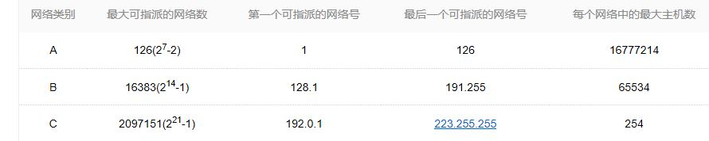
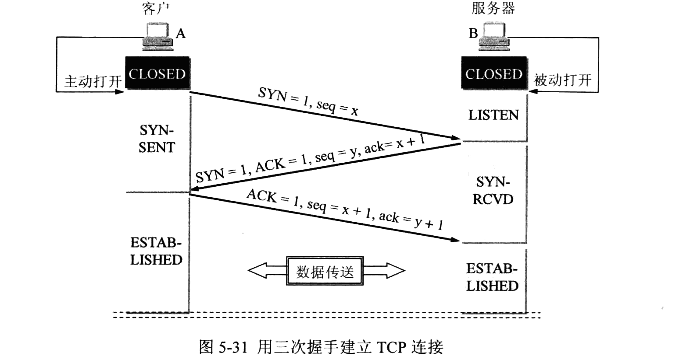
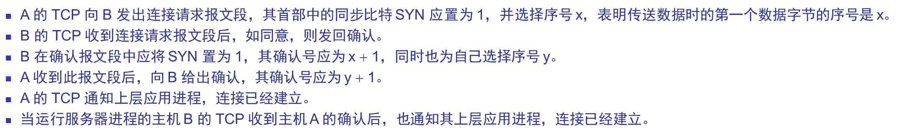
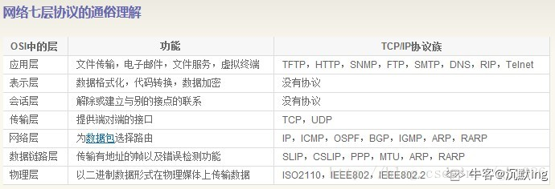

#### 1.物理层的接口的特性 

（1） 机械特性     指明接口所用的接线器的形状和尺寸、引线数目和排列、固定和锁定装置等等。 
（2） 电气特性 	指明在接口电缆的各条线上出现的电压的范围。 
（3） 功能特性 	指明某条线上出现的某一电平的电压表示何意。 
（4）规程特性 	 指明对于不同功能的各种可能事件的出现顺序。 

#### 2.  IP地址的指派范围

A类地址：0开头，8位网络号 

B类地址：10开头，16位网络号

C类地址：110开头，24位网络号

D类地址：1110开头，多播地址

E类地址：1111开头，保留为以后使用 

其中A、B、C类的保留地址（内网地址）：
A类的保留地址：10.0.0.0 ~ 10.255.255.255
B类的保留地址：172.16.0.0 ~ 172.31.255.255
C类的保留地址：192.168.0.0 ~ 192.168.255.255

可以看到，主机号全为0或网络号全为0的IP地址不可用作目的地址，主机号全为1的IP地址不可用作源地址。

IPv4 32位，IPv6 128位

#### 3.TCP三次握手

seq 序号 ， ack 确认号

4.同轴电缆和光缆

1）应用范围上有区别。同轴电缆现多用于能源传输及低端数据信息传输（如电话）；光缆多用于数据传输。 

2）传输速度，光缆比同轴电缆快很多。

5.组播

组播地址为D类地址 

组播地址范围224.0.0.0-239.255.255.255 
加入此范围内的某组播组，就成为了该组成员，可以识别并接收以该IP组播地址为目的地址的IP报文。

为了实现可靠数据传输， TCP 协议的通信双方， 都必须维护一个序列号， 以标识发送出去的数据包中， 哪些是已经被对方收到的。 三次握手的过程即是通信双方相互告知序列号起始值， 并确认对方已经收到了序列号起始值的必经步骤
如果只是两次握手， 至多只有连接发起方的起始序列号能被确认， 另一方选择的序列号则得不到确认

#### 6.（协议相关）你知道TCP协议、IP协议、HTTP协议分别在哪一层吗？

TCP运输层， IP网络层 ，HTTP应用层

网络七层模型： 
    物理层，数据链路层，网络层，运输层，会话层，表现层，应用层

网络五层模型： 
    物理层，数据链路层，网络层，运输层，应用层

传输层协议:UDP,TCP

应用层协议:FTP(文件传输协议),  Telnet(远程登录协议),  SMTP(电子邮件协议)   ,网络文件服务协议(NFS),

DNS(域名解析)

网络层协议:IP,ARP(地址解析协议)   路由协议（存疑）

ARP协议（Address Resolution Protocol，地址解析协议），属于IPv4协议簇，工作在数据链路层。其功能是将IP地址解析为对应的MAC地址。

RARP协议（Reverse ARP，反向ARP协议），其功能是将MAC地址解析为对应的IP地址。

数据发送时是自上而下，层层加码；数据接收时是自下而上，层层解码。

PPP协议（点对点传输协议，为在同等单元之间传输数据包这样的简单链路设计的链路层协议。）有两种认证方式，PAP(口令鉴别协议)方式和CHAP（口令握手鉴别协议）方式。PAP只需进行一次认证，并且只在链路初始状态时执行。而且用户名与密码的传送方式是明文的。CHAP采用周期性的验证，并且认证内容经过MD5加密后再传送，安全性要比PAP高。 

虚拟专用网（英语：Virtual Private Network，简称VPN），是一种常用于连接中、大型企业或团体与团体间的私人网络的通讯方法。虚拟私人网络的讯息透过公用的网络架构（例如：互联网）来传送内联网的网络讯息。它利用已加密的通道协议（Tunneling Protocol）来达到保密、发送端认证、消息准确性等私人消息安全效果。

RIP(Routing Information Protocol,路由信息协议）是一种内部网关协议（IGP），是一种动态路由选择协议，用于自治系统（AS）内的路由信息的传递。RIP协议基于距离矢量算法（DistanceVectorAlgorithms），使用“跳数”(即metric)来衡量到达目标地址的路由距离。这种协议的路由器只关心自己周围的世界，只与自己相邻的路由器交换信息，范围限制在15跳(15度)之内，再远，它就不关心了。跳数16表示不可到达。应用层协议。

SMTP是一种提供可靠且有效的电子邮件传输的协议。SMTP是建立在FTP文件传输服务上的一种邮件服务，主要用于系统之间的邮件信息传递，并提供有关来信的通知。

news协议：通过该协议可以访问Internet中各种各样的新闻组，从新闻组中获取你所需要的信息、资源，包括政治、经济、文化、人文、地理、科技等等，也可以在新闻组发布一些信息。

设计IP协议的目的是提高网络的可扩展性：一是解决互联网问题，实现大规模、异构网络的互联互通；二是分割顶层网络应用和底层网络技术之间的耦合关系，以利于两者的独立发展。根据端到端的设计原则，IP只为主机提供一种无连接、不可靠的、尽力而为的数据包传输服务

#### 7.局域网(LAN)   ,WLAN,VLAN,WAN

(1)		局域网自然就是局部地区形成的一个区域网络，其特点就是分布地区范围有限，可大可小，大到一栋建筑楼 与相邻建筑之间的连接，小到可以是办公室之间的联系。局域网自身相对其他网络传输速度更快，性能更稳定，框架简易，并且是  封闭性，这也是很多机构选择的原因所在。局域网自身的组成大体由计算机设备、网络连接设备、网络传输介质3大部分构成，其中，计算机设备又包括服务器与工作站，网络连接设备则包含了网卡、集线器、交换机，网络传输介质简单来说就是网线，由同轴电缆、双绞线及光缆3大原件构成。

(2)WLAN是Wireless Local Area Network的简称  无线局域网

(3)VLAN虚拟局域网

是指网络中的站点不拘泥于所处的物理位置，根据需要灵活划分不同的逻辑子网中的一种网络技术。

(4)WAN广域网

(5)WAN vs LAN

局域网和广域网的区别
局域网是在某一区域内的，而广域网要跨越较大的地域，那么如何来界定这个区域呢?例如，一家大型公司的总公司位于北京，而分公司遍布全国各地，如果该公司将所有的分公司都通过网络联接在一起，那么一个分公司就是一个局域网，而整个总公司网络就是一个广域网。

那路由器的WAN 口和LAN 口又有什么区别?
现在的宽带路由器实际上是路由+ 交换机的一体结构，我们可以把它当成是两台设备。
WAN：接外部 IP 地址用，通常指的是出口，转发来自内部 LAN 接口的 IP 数据包。
LAN：接内部 IP 地址用，LAN 内部是交换机。我们可以不连接 WAN 口，把路由器当做普通交换机来使用。

WIFI 是实现无线组网的一种协议(实际上是握手协议)，WIFI 是 WLAN 的一个标准。

#### 8.网关，网桥，网卡

综述：  网关是邮电局,所有的信息必须通过这里的打包、封箱、寻址，才能发出去与收进来；网卡是设备，也就是邮电局邮筒，你家的信箱；而网桥是邮递员，但他只负责一个镇里面(局域网)不负责广域网。

网卡是一块被设计用来允许计算机在计算机网络上进行通讯的计算机硬件。每一个网卡都有一个被称为MAC地址的独一无二的48位串行号，它被写在卡上的一块ROM中。在网络上的每一个计算机都必须拥有一个独一无二的MAC地址。没有任何两块被生产出来的网卡拥有同样的地址。这是因为电气电子工程师协会（IEEE）负责为网络接口控制器（网卡）销售商分配唯一的MAC地址。

网卡上面装有处理器和存储器（包括RAM和ROM）。网卡和局域网之间的通信是通过电缆或双绞线以串行传输方式进行的。而网卡和计算机之间的通信则是通过计算机主板上的I/O总线以并行传输方式进行。

网关（Gateway） [1]  就是一个网络连接到另一个网络的“关口”。也就是网络关卡。

9.服务器和工作站：

可以按照主要应用来区分工作站与服务器，以提供高性能数值及图形/图像计算服务为主的单机，可称作工作站；以提供网络服务为主的单机或集群，称作服务器更恰当一些。

工作站是来跑百米赛的，强调快。
服务器是跑马拉松的，强调耐久。

10.dns：

当客户端发出DNS查询请求bai，从du服务器收到的响应报文中的zhiTC（删减标志）比特被置为1时，表示应答总长dao度超过512字节，只返回前512个字节，这时DNS就需要使用TCP重发原来的查询请求。因为在UDP的应用程序中，其应用程序被限制在512个字节或更小，因此DNS报文穿数据流只能有512字节，而TCP能将用户的数据流分为一些报文段，因此TCP就能用多个报文段去传超过512字节的数据流或是任意长度的数据流。

11.MAC地址和IP地址

MAC地址是烧录在网卡或者接口上的物理地址，具有二层意义和全球唯一性，一般不能被改变。IP地址是网络中的主机或者三层接口在网络中的逻辑地址，在同一个网络内具有唯一性。

物理地址是数据链路层和物理层使用的地址；IP地址是网络层及其以上层使用的地址。

#### 12.状态码：

• 200：请求被正常处理 
• 204：请求被受理但没有资源可以返回 
• 206：客户端只是请求资源的一部分，服务器只对请求的部分资源执行GET方法，相应报文中通过Content-Range指定范围的资源。 
• 301：永久性重定向 
• 302：临时重定向 
• 303：与302状态码有相似功能，只是它希望客户端在请求一个URI的时候，能通过GET方法重定向到另一个URI上 
• 304：发送附带条件的请求时，条件不满足时返回，与重定向无关 
• 307：临时重定向，与302类似，只是强制要求使用POST方法 
• 400：请求报文语法有误，服务器无法识别 
• 401：请求需要认证 
• 403：请求的对应资源禁止被访问 
• 404：服务器无法找到对应资源 
• 500：服务器内部错误 
• 502：服务器挂了
• 503：服务器正忙

13.多路复用：

传输媒体的带宽或容量往往会大于传输单一信号的需求，为了有效地利用通信线路,希望一个信道同时传输多路信号，这就是多路复用技术。采用多路复用技术能把多个信号组合起来在一条物理信道上进行传输，在远距离传输时可大大节省电缆的安装和维护费用。

TDM时分复用，FDM频分复用(用不同频率)

#### 14.一些编码：

曼彻斯特编码，常用于局域网传输。曼彻斯特编码将时钟和数据包含在数据流中，在传输代码信息的同时，也将时钟同步信号一起传输到对方，每位编码中有一跳变，不存在直流分量，因此具有自同步能力和良好的抗干扰性能。但每一个码元都被调成两个电平，所以数据传输速率只有调制速率的1/2。 

### 15.端口号：

所谓的端口，就好像是门牌号一样，客户端可以通过ip地址找到对应的服务器端，但是服务器端是有很多端口的，每个应用程序对应一个端口号，通过类似门牌号的端口号，客户端才能真正的访问到该服务器。为了对端口进行区分，将每个端口进行了编号，这就是端口号 [1]  。

端口号的主要作用是表示一台计算机中的特定进程所提供的服务。网络中的计算机是通过IP地址来代表其身份的，它只能表示某台特定的计算机，但是一台计算机上可以同时提供很多个服务，如数据库服务、FTP服务、Web服务等，我们就通过端口号来区别相同计算机所提供的这些不同的服务，如常见的端口号21表示的是FTP服务，端口号23表示的是Telnet服务端口号25指的是SMTP服务等。端口号一般习惯为4位整数，在同一台计算机上端口号不能重复，否则，就会产生端口号冲突这样的例外