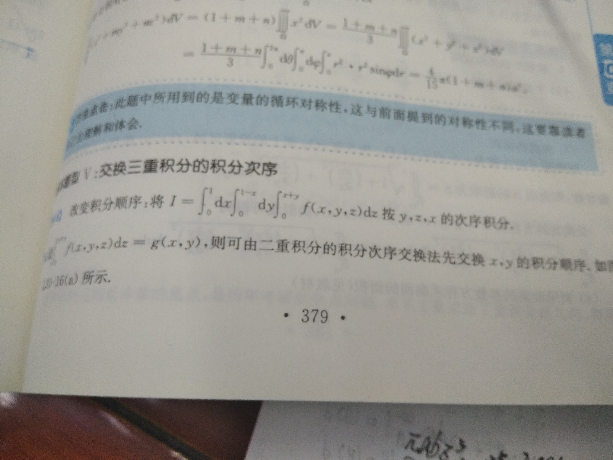
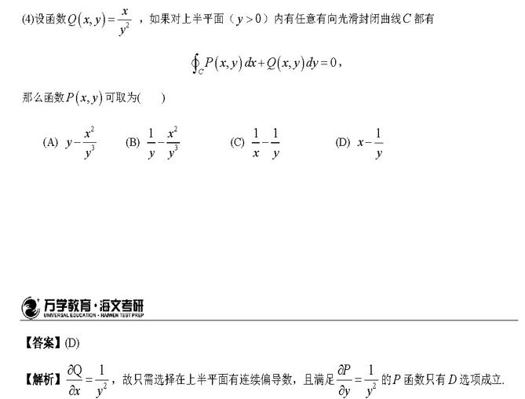
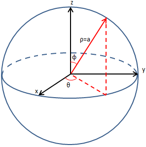
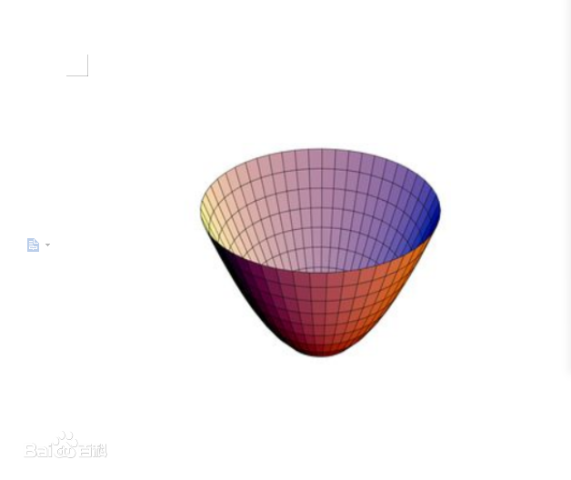
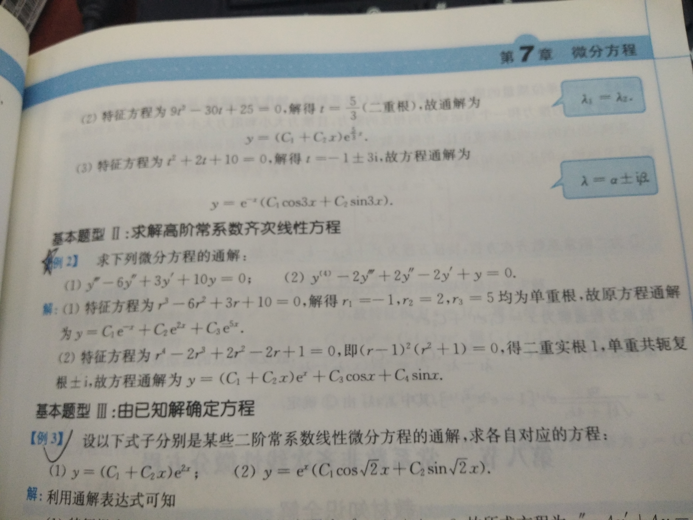
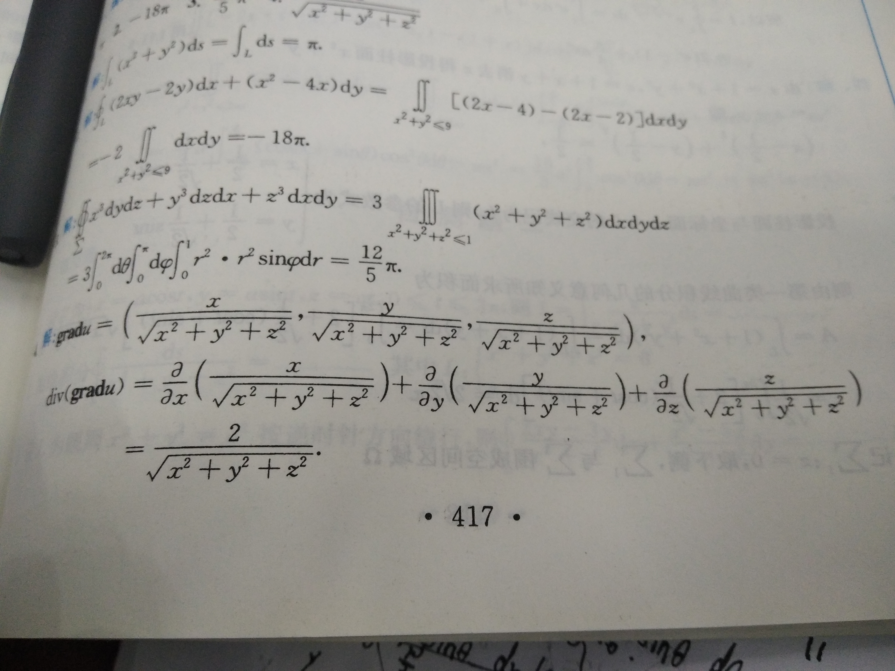

### a1.多元积分

##### （1）椭圆面积公式：

仿射变换法bai其实从椭圆方程可知du，椭圆是一个被“压缩”了的圆。设椭zhi圆方程为：(x/a)^2+(y/b)^2=1令：x'=x，y'=y*a/b，我们dao就可以在新的坐标系中得到一个圆：x'^2+y'^2=a^2新坐标系其实是一个在y方向等比（比例为a/b）拉长了的坐标系，这样在新坐标系得到面积 S=π*a^2后，再乘以比例b/a后得到：S=π*a*b 就是所求答案


#####  (2) 变量代换：


##### （3）交换三重积分的顺序：




##### （4）利用对称性：


（5）




### （5）曲线积分：使用格林公式化为面积相关（一维到二维）

条件P(x,y),Q(x,y)在闭合区域上有一阶连续偏导数


格林公式挖洞法：


#### （6）曲面积分：


##### （7）高斯公式（三维到二维）要对封闭空间使用，所以可能要补全


#### (8)斯托克斯公式


### 2.雅可比行列式：

直角坐标转极坐标：rdrdθ


直接坐标转球坐标：

x=rsinφcosθ.
y=rsinφsinθ.
z=rcosφ.

φ∈(0,兀),θ∈(0,2兀)。  r^2*sinφdrdθdφ




### 3.一些图像：

##### （1）抛物面：



双曲抛物面


椭圆抛物面


##### （2）锥面：

z=1-sqrt(x^2+y^2)


### 4.一些积分公式：

（1）∫ secx dx = ln|secx + tanx| + C

```
证明：∫secx dx= ∫ secx • (secx + tanx)/(secx + tanx) dx= 
∫ (secxtanx + sec²x)/(secx + tanx) dx= ∫ d(secx + tanx)/(secx + tanx)
= ln|secx + tanx| + C
```

（2）∫dx/√(x^2-a^2)=ln|x+√(x^2-a^2)|+C

```
∫dx/√(x^2-a^2)
令x=asect
dx=atantsectdt
原式=∫atantsect/√(a^2(sect)^2-a^2) dt=∫atantsect/(atant)dt
=∫sectdt=ln|sect+tant|+C
sect=x/a
tant=√[(sect)^2-1]=[√(x^2-a^2)]/a
原式=ln|x+√(x^2-a^2)|+C
```


（3）符号出了问题，思路和结论是对的。


### 5.微分方程：


#### （1）常数变易法，伯努利方程：


#### （2）利用特征根法求微分方程：




#### （3）全微分：


### 6.物理相关：

##### （1）重心


##### （2）转动惯量


##### （3）散度，梯度，旋度


例题	u=sqrt(x*x+y*y+z*z),div(grad(u))=???

