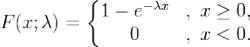

### 1.指数分布

分布函数：

概率密度函数：

数学期望：1/入    对 xf(x) 积分。

方差:1/入^2

### 2.协方差

如果X与Y是统计独立的(这表示不相关)，那么二者之间的协方差就是0，因为两个独立的随机变量满足E[XY]=E[X]E[Y]。

E（ax+b）＝a * Ex+b
D（ax+b）＝a^2 * Dx
Dx＝E（x^2）-（Ex）^2

E(x^2)= 对x^2*f(x)积分

### 3.独立和不相关的区别

（1）独立一定不相关，不相关不一定独立（高斯过程里二者等价） 

（2）假设X为一个随机过程，则在t1和t2时刻的随机变量的相关定义如下（两个随机过程一样）： 
		@@@定义Kx（t1，t2）=E{[X（t1）-Mx(t1)][X(t2)-Mx(t2)]}为协方差函数，若K=0，即相关系数为0，则称之为不相关；不相关只是说二者没有线形关系，但并不代表没有任何关系。 
		@@@独立性。就用他们的概率分布函数或密度来表达。联合分布等于他们各自分布的乘积，独立的定义是 F(x,Y)=F(x)F(Y)，就称独立。

### 4.正态分布

∫-,+ e^(-x^2/2) dx =  √π

∫0,+ e^(-(x-u)^2/2σ^2) dx =  ∫e^(-x^2/2σ^2) d(x) (其实是换元)=∫e^(-t^2)dt * √2*σ   (此时t=x/（√2 *σ)   ）

=(√π/2)* (√2 * σ)   =σ*√（π /2）

### 5.最大似然估计：

##### 求解步骤

(1)写出似然函数	

(2)对似然函数两边取对数	

(3)对 ln(θ)求导数并令之为0：

##### 例题

